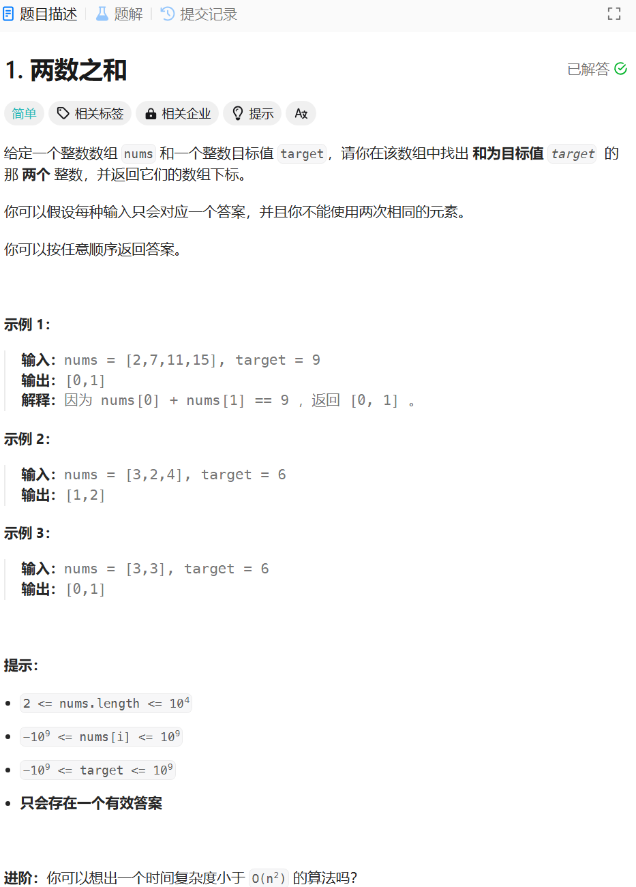

# 1. 两数之和
## 题目链接  
[1. 两数之和](https://leetcode.cn/problems/two-sum/)
## 题目详情


***
## 解答一
答题者：**Yuiko630**

### 题解
>。

### 代码
``` Java
class Solution {
    public int[] twoSum(int[] nums, int target) {
        Map<Integer, Integer> record = new HashMap<Integer, Integer>();
        int num = 0;
        int[] result =new int[2];
        for(int i = 0; i < nums.length; i++){
            num = target - nums[i];
            if(record.containsKey(num)){
                result[0] = record.get(num);
                result[1] = i;
                return result;
            }
            else{
                record.put(nums[i], i);
            }
        }
        return result;
    }
}
```