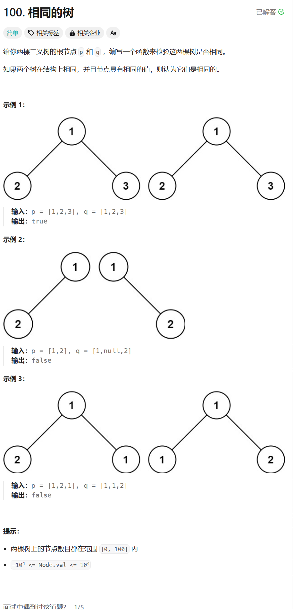

# 100. 相同的树
## 题目链接  
[100. 相同的树](https://leetcode.cn/problems/same-tree/description/)
## 题目详情


***
## 解答一
答题者：**Yuiko630**

### 题解
>递归比较，全空则true，一空则false，不空比较值，最后递归比较左右孩子。

### 代码
``` Java
/**
 * Definition for a binary tree node.
 * public class TreeNode {
 *     int val;
 *     TreeNode left;
 *     TreeNode right;
 *     TreeNode() {}
 *     TreeNode(int val) { this.val = val; }
 *     TreeNode(int val, TreeNode left, TreeNode right) {
 *         this.val = val;
 *         this.left = left;
 *         this.right = right;
 *     }
 * }
 */
class Solution {
    public boolean isSameTree(TreeNode p, TreeNode q) {
        if (p == null && q == null) {
            return true;
        } 
        else if (p == null || q == null) {
            return false;
        } 
        else if (p.val != q.val) {
            return false;
        } 
        else {
            return isSameTree(p.left, q.left) && isSameTree(p.right, q.right);
        }
    }
}
```


