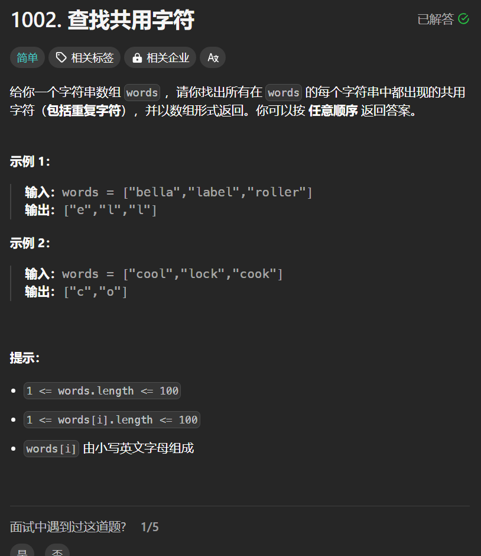

# 1002. 查找共用字符
## 题目链接  
[1002. 查找共用字符](https://leetcode.cn/problems/find-common-characters/description/)
## 题目详情


***
## 解答一
答题者：**Yuiko630**

### 题解
>对于每个单词统计一下字符出现频率，所有单词字符的最小出现频率即为共用字符频率。

### 代码
``` Java
class Solution {
    public List<String> commonChars(String[] words) {
        int[] freq = new int[26];
        int[] minFreq = new int[26];
        for(int i = 0; i < 26; i++){
            minFreq[i] = Integer.MAX_VALUE;
        }
        for(String word : words){
            char[] chars = word.toCharArray();
            for(int i = 0; i < chars.length; i++){
                freq[chars[i] - 'a']++;
            }
            for(int i = 0; i < 26; i++){
                minFreq[i] = Math.min(minFreq[i], freq[i]);
                freq[i] = 0;
            }
        }
        ArrayList<String> result = new ArrayList<>();
        for(int i = 0; i < 26; i++){
            for(int j = 0; j < minFreq[i]; j++){
                char c= (char) (i+'a');
                result.add(String.valueOf(c));
            }
        }
        return result;
    }
}
```