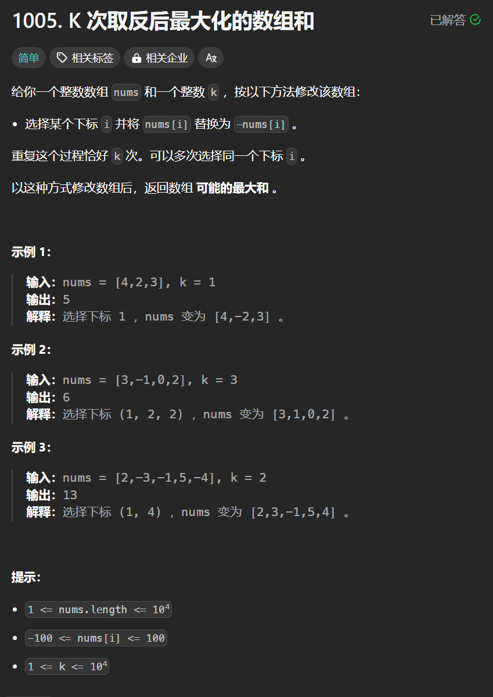

# 1005. K次取反后最大化的数组和
## 题目链接  
[1005. K次取反后最大化的数组和](https://leetcode.cn/problems/maximize-sum-of-array-after-k-negations/description/)
## 题目详情


***
## 解答一
答题者：**Yuiko630**

### 题解
>贪心，局部最优，让绝对值大的负数变为正数，如果k还>0，则找数值最小的进行反转。①按绝对值大小从大到小排序；②从前向后将负数取反；③若k>0，则反复转变数值最小的元素，直到将k用完；④求和

### 代码
``` Java
class Solution {
    public int largestSumAfterKNegations(int[] nums, int k) {
        int sum = 0;
        for(int i = 0; i < nums.length; i++){
            for(int j = 0; j < nums.length-i-1; j++){
                if(Math.abs(nums[j]) < Math.abs(nums[j+1])){
                    int temp = nums[j];
                    nums[j] = nums[j + 1];
                    nums[j + 1] = temp;
                }
            }
        }
        for(int i = 0; i < nums.length; i++){
            if(nums[i] < 0){
                nums[i] = -nums[i];
                k--;
            }
            if(k <= 0) break;
        }
        while(k > 0){
            nums[nums.length - 1] = -nums[nums.length - 1];
            k--;
        }
        for(int i = 0; i < nums.length; i++){
            sum += nums[i];
        }
        return sum;
    }
}
```