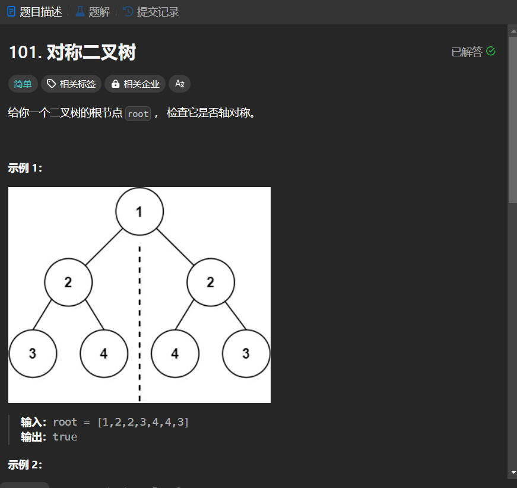

# 101. 对称二叉树
## 题目链接  
[101. 对称二叉树](https://leetcode.cn/problems/symmetric-tree/description/)
## 题目详情


***
## 解答一
答题者：EchoBai

### 题解
递归比较左子树的左孩子是否和右子树的右孩子以及左子树的右孩子和右子树的左孩子是否相等即可。

### 代码
``` cpp
/**
 * Definition for a binary tree node.
 * struct TreeNode {
 *     int val;
 *     TreeNode *left;
 *     TreeNode *right;
 *     TreeNode() : val(0), left(nullptr), right(nullptr) {}
 *     TreeNode(int x) : val(x), left(nullptr), right(nullptr) {}
 *     TreeNode(int x, TreeNode *left, TreeNode *right) : val(x), left(left), right(right) {}
 * };
 */
class Solution {
public:
    bool isSymmetric(TreeNode* root) {
        return compare(root->left,root->right);
    }
    bool compare(TreeNode* left, TreeNode* right){
        if(!left && !right) return true;
        if(!left || !right) return false;
        if(left->val != right->val) return false;
        return compare(left->left,right->right) &&compare(left->right,right->left);
    }
};
```


