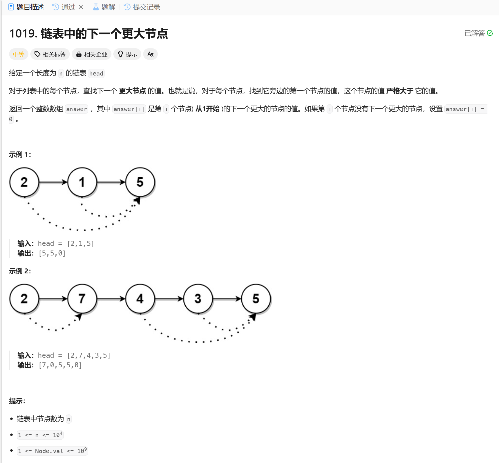

# 1019. 链表中的下一个更大节点
## 题目链接  
[1019. 链表中的下一个更大节点](https://leetcode.cn/problems/next-greater-node-in-linked-list/description/)
## 题目详情


***
## 解答一
答题者：EchoBai

### 题解
用单调栈来实现，如果当前元素大于栈内元素，那就入栈，否则出栈，直到栈为空。也可以直接暴力遍历求解。

### 代码
``` cpp
/**
 * Definition for singly-linked list.
 * struct ListNode {
 *     int val;
 *     ListNode *next;
 *     ListNode() : val(0), next(nullptr) {}
 *     ListNode(int x) : val(x), next(nullptr) {}
 *     ListNode(int x, ListNode *next) : val(x), next(next) {}
 * };
 */
class Solution {
public:
    vector<int> nextLargerNodes(ListNode* head) {
        std::vector<int> vt;
        ListNode* p = head;
        while(p){
            vt.emplace_back(p->val);
            p = p->next;
        }
        int size = vt.size();

        std::vector<int>res(size, 0);
        std::stack<int> st;

        for(int i = 0; i < size; ++i){
            while(!st.empty() && vt[i] > vt[st.top()]){
                res[st.top()] = vt[i];
                st.pop();
            }
            st.push(i);
        }

        // for(int i = 0; i < size; ++i){
        //     for(int j = i + 1; j < size; ++j){
        //         if(vt[j] > vt[i]){
        //             res[i] = vt[j];
        //             break;
        //         }
        //     }
        // }
        
        return res;
    }
};
```
