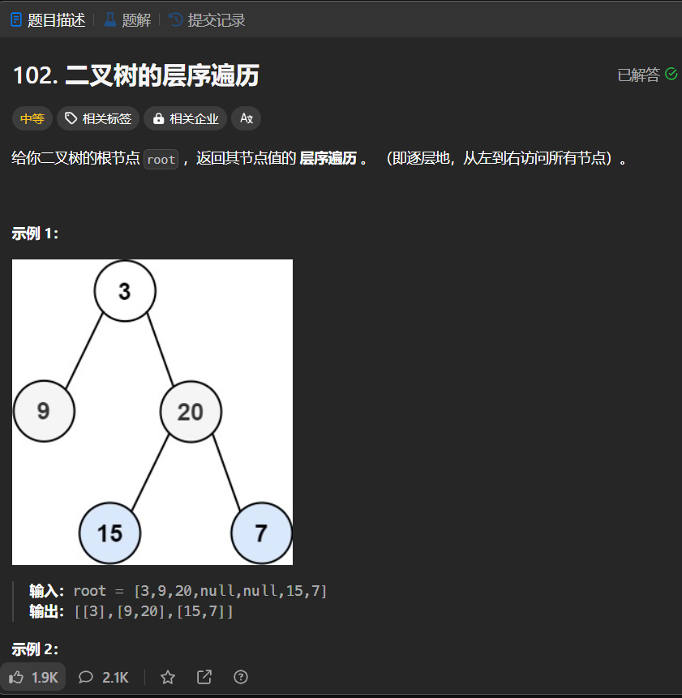

# 102. 二叉树的层序遍历
## 题目链接  
[102. 二叉树的层序遍历](https://leetcode.cn/problems/binary-tree-level-order-traversal/description/)
## 题目详情


***
## 解答一
答题者：EchoBai

### 题解
使用队列，首先将根入队，然后做访问操作，出队，判断根是否有左右节点，有就入队。重复该操作，直到队列为空。
### 代码
``` cpp
/**
 * Definition for a binary tree node.
 * struct TreeNode {
 *     int val;
 *     TreeNode *left;
 *     TreeNode *right;
 *     TreeNode() : val(0), left(nullptr), right(nullptr) {}
 *     TreeNode(int x) : val(x), left(nullptr), right(nullptr) {}
 *     TreeNode(int x, TreeNode *left, TreeNode *right) : val(x), left(left), right(right) {}
 * };
 */
class Solution {
public:
    vector<vector<int>> levelOrder(TreeNode* root) {
        queue<TreeNode*> q;
        vector<vector<int>> res;
        if(!root)return res;
        q.push(root);
        while(!q.empty()){
            vector<int> v;
            for(int i = q.size(); i > 0 ; --i){
                TreeNode* e =  q.front();
                q.pop();
                visit(v,e->val);
                if(e->left) q.push(e->left);
                if(e->right) q.push(e->right);
            }
            res.push_back(v);
        }
        return res;
        
    }
    void visit(vector<int> &res, int val){
        res.push_back(val);
    }
};
```


