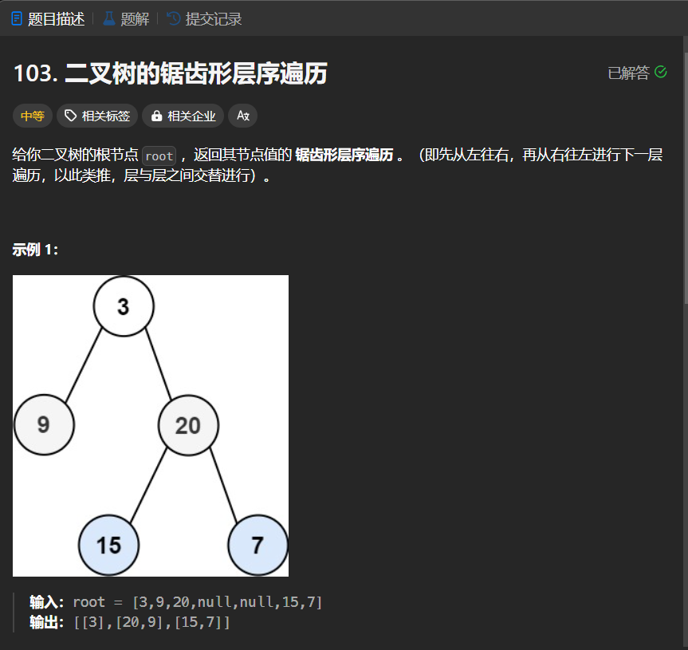

# 103. 二叉树的锯齿形层序遍历
## 题目链接  
[103. 二叉树的锯齿形层序遍历](https://leetcode.cn/problems/binary-tree-zigzag-level-order-traversal/description/)
## 题目详情


***
## 解答一
答题者：EchoBai

### 题解
基本思想为层序遍历的思想，即用栈来存储存在的子节点。此处只需要处理偶数层输出的情况，从右往左输出可以用栈来存储，这样最后在依次弹出元素即可。然后用标志位来判断此时是处于偶数还是奇数层。也可以使用双端队列的，偶数层就顺序出队，奇数层就从另一个口出队。
### 代码
``` cpp
/**
 * Definition for a binary tree node.
 * struct TreeNode {
 *     int val;
 *     TreeNode *left;
 *     TreeNode *right;
 *     TreeNode() : val(0), left(nullptr), right(nullptr) {}
 *     TreeNode(int x) : val(x), left(nullptr), right(nullptr) {}
 *     TreeNode(int x, TreeNode *left, TreeNode *right) : val(x), left(left), right(right) {}
 * };
 */
class Solution {
public:
    vector<vector<int>> zigzagLevelOrder(TreeNode* root) {
        vector<vector<int>> res;
        if(!root) return res;
        int flag = 1;
        queue<TreeNode*> q;
        q.push(root);
        while(!q.empty()){
            vector<int> ve;
            stack<int> s;
            for(int i = q.size(); i > 0; --i){
                TreeNode* e = q.front();
                if(flag)
                    ve.push_back(e->val);
                else
                    s.push(e->val);
                q.pop();
                if(e->left) q.push(e->left);
                if(e->right) q.push(e->right);
            }
            if(!flag){
                while(!s.empty()){
                    ve.push_back(s.top());
                    s.pop();
                }
            }
            res.push_back(ve);
            flag = !flag;
            
        }
        return res;

    }
};
```


