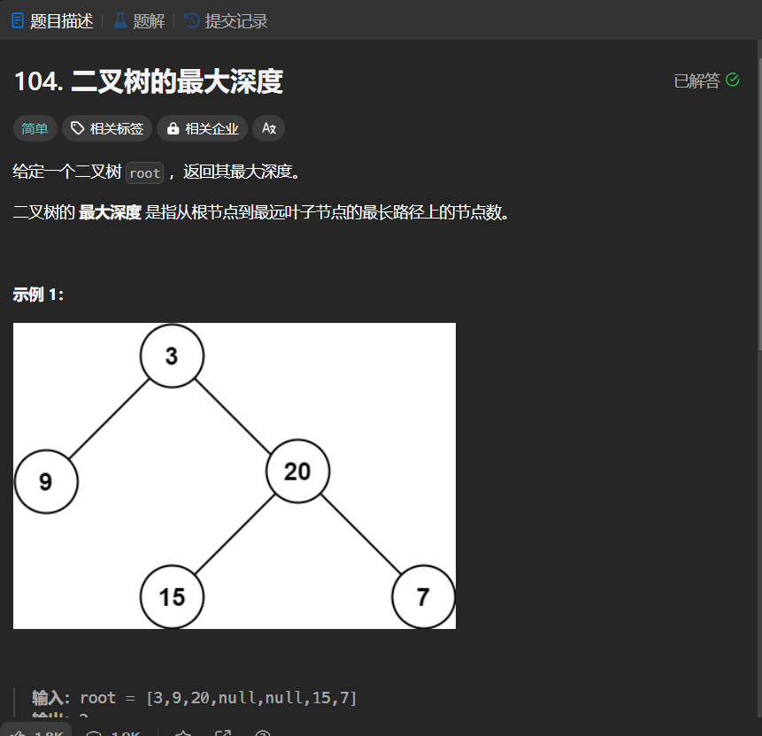

# 104. 二叉树的最大深度
## 题目链接  
[104. 二叉树的最大深度](https://leetcode.cn/problems/maximum-depth-of-binary-tree/description/)
## 题目详情


***
## 解答一
答题者：EchoBai

### 题解
递归即可。

### 代码
``` cpp
/**
 * Definition for a binary tree node.
 * struct TreeNode {
 *     int val;
 *     TreeNode *left;
 *     TreeNode *right;
 *     TreeNode() : val(0), left(nullptr), right(nullptr) {}
 *     TreeNode(int x) : val(x), left(nullptr), right(nullptr) {}
 *     TreeNode(int x, TreeNode *left, TreeNode *right) : val(x), left(left), right(right) {}
 * };
 */
class Solution {
public:
    int maxDepth(TreeNode* root) {
        if(!root) return 0;
        return max(1 + maxDepth(root->left),1+maxDepth(root->right));
    }
};
```


