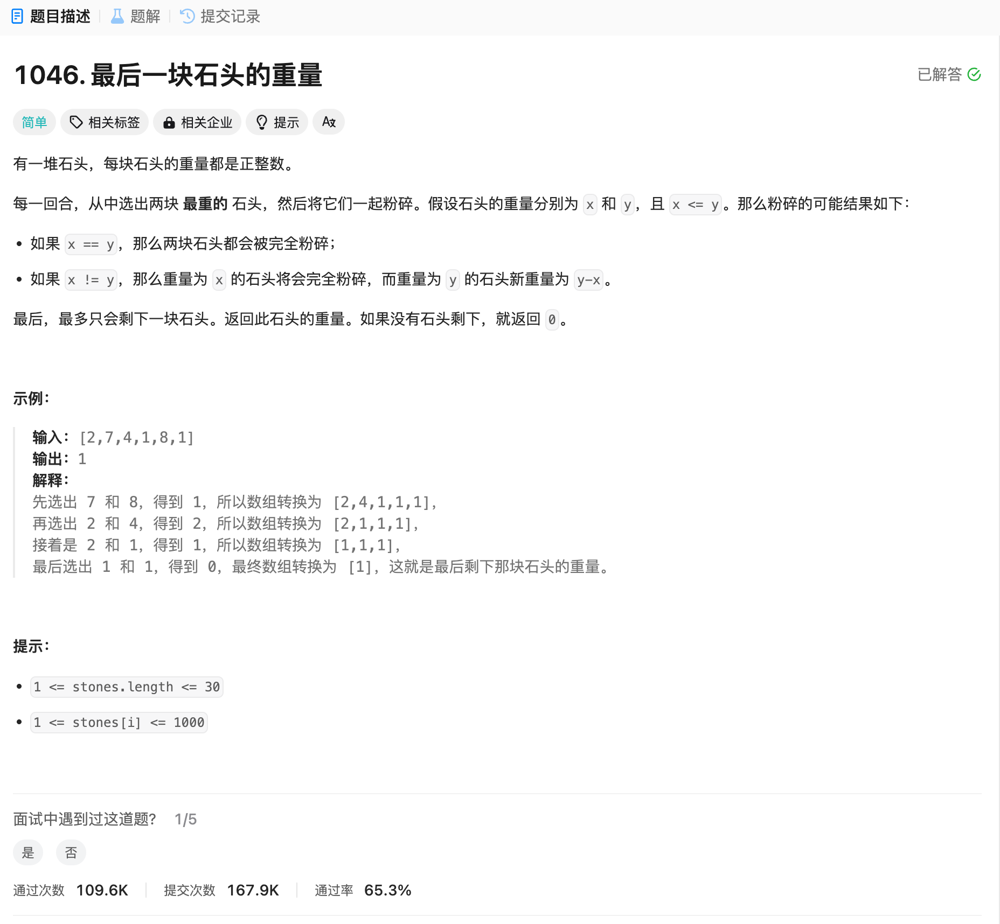

# 1046. 最后一块石头的重量
## 题目链接  
[1046. 最后一块石头的重量](https://leetcode.cn/problems/last-stone-weight/description/)
## 题目详情


***
## 解答一
答题者：EchoBai

### 题解
排序每次选取最后两个数并把结果存到倒数第二个数，把最后一个数pop出。

### 代码
``` cpp
class Solution {
public:
    int lastStoneWeight(vector<int>& stones) {
        sort(stones.begin(), stones.end());
        int size = stones.size();
        if(size < 2) return stones[0];
        for(int i = stones.size() - 1; i >=1; --i){
            stones[i-1] = stones[i] - stones[i-1]; 
            stones.pop_back();
            sort(stones.begin(), stones.end());
        }
        return stones[0];
    }
};
```


