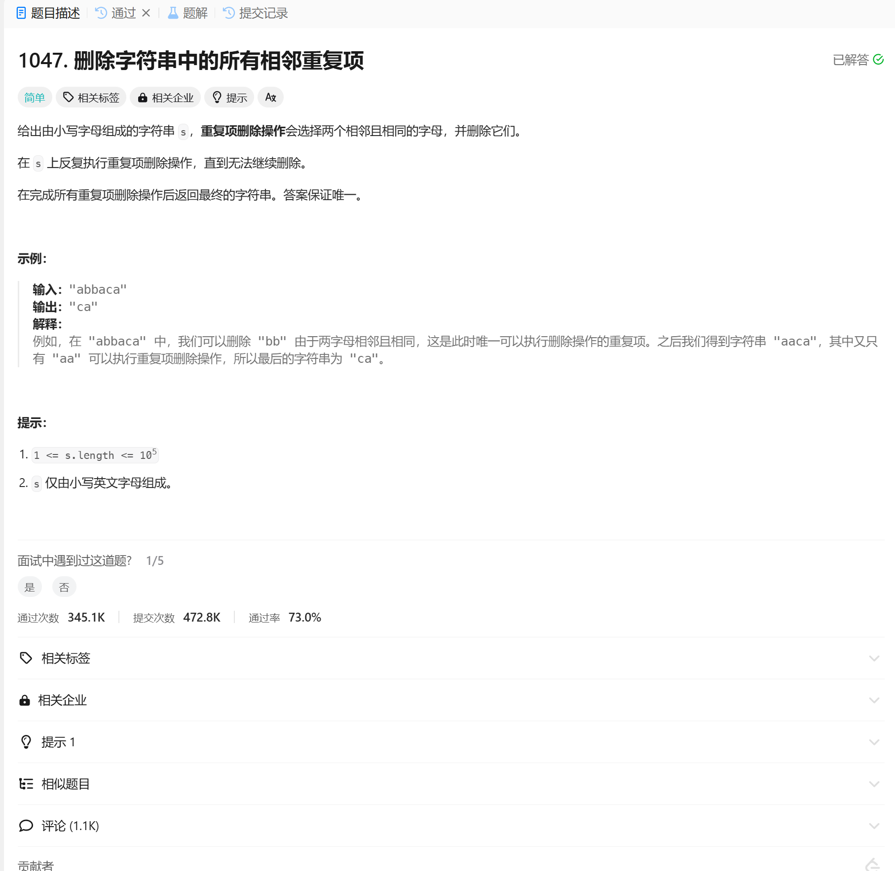

# 1047. 删除字符串中的所有相邻重复项
## 题目链接  
[1047. 删除字符串中的所有相邻重复项](https://leetcode.cn/problems/remove-all-adjacent-duplicates-in-string/description/)
## 题目详情


***
## 解答一
答题者：EchoBai

### 题解
用栈即可。

### 代码
``` cpp
class Solution {
public:
    string removeDuplicates(string s) {
        std::stack<char> sk;
        std::string res;
        int i = 0;
        while(i < s.size()){
            if(sk.empty() || sk.top() != s[i]){
                sk.push(s[i]);
            }else{
                sk.pop();
            }
            ++i;
        }

        while(!sk.empty()){
            res += sk.top();
            sk.pop();
        }
        std::reverse(res.begin(), res.end());
        return res;
    }
};
```
