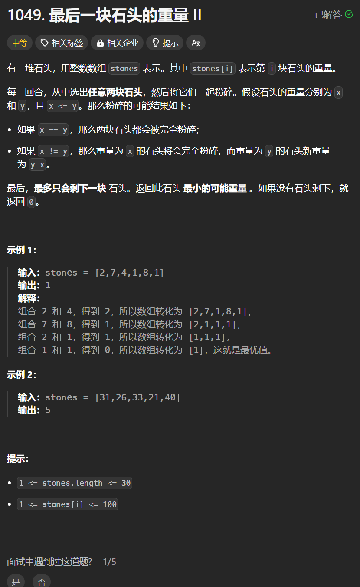

# 1049. 最后一块石头的重量II
## 题目链接  
[1049. 最后一块石头的重量II](https://leetcode.cn/problems/last-stone-weight-ii/description/)
## 题目详情


***
## 解答一
答题者：**Yuiko630**

### 题解
>可以理解为两个背包容量均为sum/2，尽量取石头填满，最后剩余的最小石头即sum-dp[sum/2]-dp[sum/2]。

### 代码
``` Java
class Solution {
    public int lastStoneWeightII(int[] stones) {
        int sum = 0;
        for(int i = 0; i < stones.length; i++){
            sum += stones[i];
        }
        int[] dp = new int[sum/2+1];
        for(int i = 0; i < stones.length; i++){
            for(int j = sum/2; j >= stones[i]; j--){
                dp[j] = Math.max(dp[j], dp[j-stones[i]]+stones[i]);
            }
        }
        return sum - dp[sum/2] - dp[sum/2];
    }
}
```