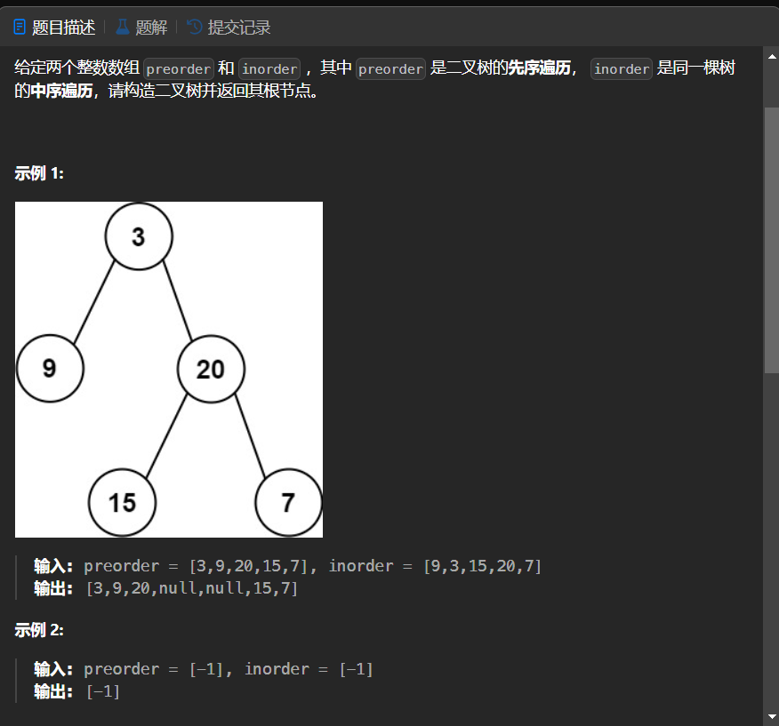

# 105. 从前序与中序遍历序列构造二叉树
## 题目链接  
[105. 从前序与中序遍历序列构造二叉树](https://leetcode.cn/problems/construct-binary-tree-from-preorder-and-inorder-traversal/description/)
## 题目详情


***
## 解答一
答题者：EchoBai

### 题解
首先根据前序遍历的结果可将中序序列划分为左右子树各自的中序序列，又根据划分后的左右子树节点确定出左右子树的前序序列。这样我们就得到了左右子树的前序和中序，便能递归的去创建子树了。递归的终止条件即是，当当前序列只有一个节点时我们创建该节点并返回，当前序列为空，直接返回空即可。

### 代码
``` cpp
/**
 * Definition for a binary tree node.
 * struct TreeNode {
 *     int val;
 *     TreeNode *left;
 *     TreeNode *right;
 *     TreeNode() : val(0), left(nullptr), right(nullptr) {}
 *     TreeNode(int x) : val(x), left(nullptr), right(nullptr) {}
 *     TreeNode(int x, TreeNode *left, TreeNode *right) : val(x), left(left), right(right) {}
 * };
 */
class Solution {
public:
    TreeNode* buildTree(vector<int>& preorder, vector<int>& inorder) {
        int n = preorder.size();
        if(n == 0) return nullptr;
        if(n == 1) return new TreeNode(preorder[0]);

        int j = -1;
        for(int i = 0; i < n ; ++i){
            if(inorder[i] == preorder[0]){
                j = i;
                break;
            }
        }

        TreeNode* root = new TreeNode(preorder[0]);
        vector<int> in_ltree, in_rtree;
        for(int i = 0; i < j; ++i)
            in_ltree.push_back(inorder[i]);
        for(int i = j + 1; i < n; ++i)
            in_rtree.push_back(inorder[i]);
        int leftCnt = in_ltree.size();
        vector<int> pre_ltree,pre_rtree;
        for(int i = 1; i <= leftCnt; ++i)
            pre_ltree.push_back(preorder[i]);
        for(int i = leftCnt + 1; i < n; ++i)
            pre_rtree.push_back(preorder[i]);
        
        root->left = buildTree(pre_ltree,in_ltree);
        root->right = buildTree(pre_rtree,in_rtree);

        return root;
    }
};
```


