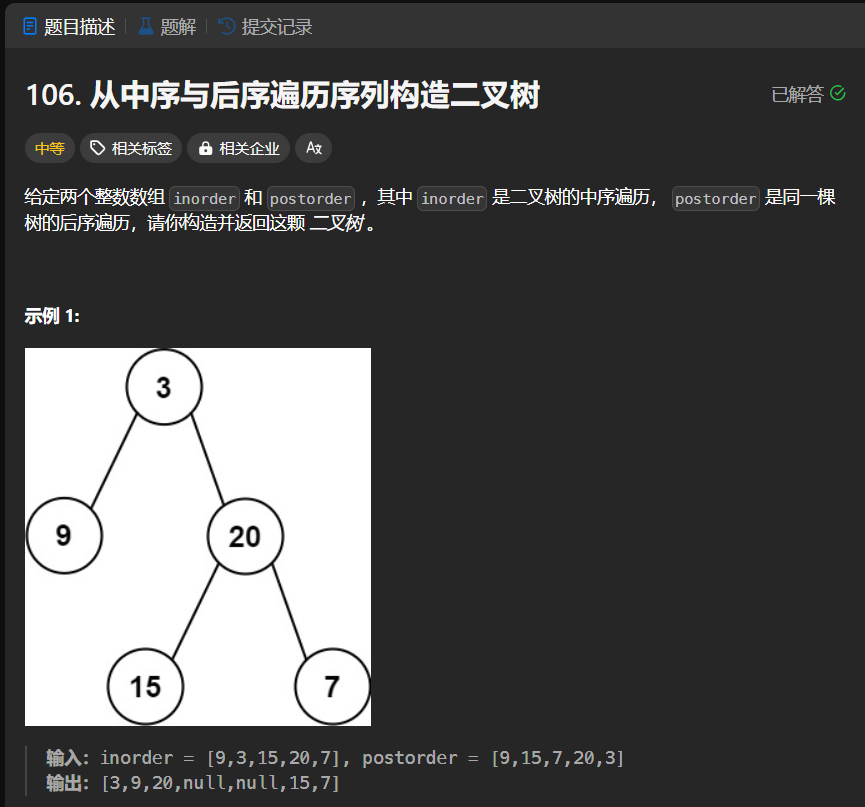

# 106. 从中序与后序遍历序列构造二叉树
## 题目链接  
[106. 从中序与后序遍历序列构造二叉树](https://leetcode.cn/problems/construct-binary-tree-from-inorder-and-postorder-traversal/description/?envType=daily-question&envId=2024-02-21)
## 题目详情


***
## 解答一
答题者：EchoBai

### 题解
从后序遍历最后节点开始划分左右子树，分别找出左右子树中序和后序序列，然后递归的建就行。

### 代码
``` cpp
/**
 * Definition for a binary tree node.
 * struct TreeNode {
 *     int val;
 *     TreeNode *left;
 *     TreeNode *right;
 *     TreeNode() : val(0), left(nullptr), right(nullptr) {}
 *     TreeNode(int x) : val(x), left(nullptr), right(nullptr) {}
 *     TreeNode(int x, TreeNode *left, TreeNode *right) : val(x), left(left), right(right) {}
 * };
 */
class Solution {
public:
    TreeNode* buildTree(vector<int>& inorder, vector<int>& postorder) {
        int n = postorder.size();
        if(n == 0) return nullptr;
        if(n == 1) return new TreeNode(postorder[n - 1]);
        int index = -1; 
        for(int i = 0; i < n; ++i){
            if(inorder[i] == postorder[n - 1]){
                index = i;
                break;
            }
        } 
        TreeNode* root = new TreeNode(postorder[n - 1]);
        vector<int> l_inorder,r_inorder;
        for(int i = 0; i < index; ++i){
            l_inorder.push_back(inorder[i]);
        }
        for(int i = index + 1; i < n; ++i){
            r_inorder.push_back(inorder[i]);
        }
        int left_cnt = l_inorder.size();
        vector<int> l_postorder,r_postorder;
        for(int i = left_cnt; i <= n -2; ++i){
            r_postorder.push_back(postorder[i]);
        }
        for(int i = 0; i < left_cnt; ++i){
            l_postorder.push_back(postorder[i]);
        }
        root->left = buildTree(l_inorder,l_postorder);
        root->right = buildTree(r_inorder,r_postorder);
        return root;
    }
};
```


