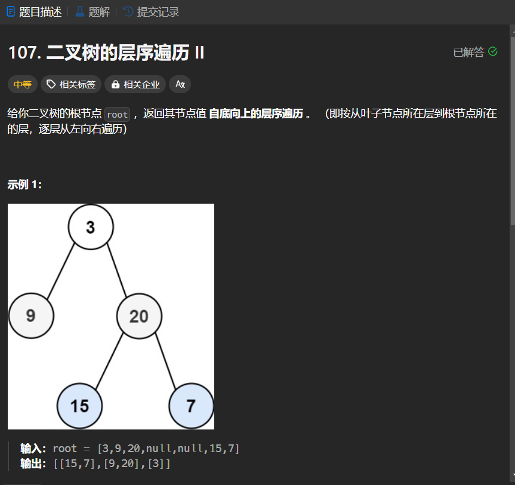

# 107. 二叉树的层序遍历 II
## 题目链接  
[107. 二叉树的层序遍历 II](https://leetcode.cn/problems/binary-tree-level-order-traversal-ii/description/)
## 题目详情


***
## 解答一
答题者：EchoBai

### 题解
使用队列，首先将根入队，然后做访问操作，出队，并且将元素压入一个栈中，再判断根是否有左右节点，有就入队。重复该操作，直到队列为空。这样做完之后栈中的元素就是层序遍历的结果，再利用栈的性质将结果弹出，得到的就是最终的结果。
### 代码
``` cpp
/**
 * Definition for a binary tree node.
 * struct TreeNode {
 *     int val;
 *     TreeNode *left;
 *     TreeNode *right;
 *     TreeNode() : val(0), left(nullptr), right(nullptr) {}
 *     TreeNode(int x) : val(x), left(nullptr), right(nullptr) {}
 *     TreeNode(int x, TreeNode *left, TreeNode *right) : val(x), left(left), right(right) {}
 * };
 */
class Solution {
public:
    vector<vector<int>> levelOrderBottom(TreeNode* root) {
        queue<TreeNode*> q;
        vector<vector<int>> res;
        stack<vector<int>> s;
        if(!root)return res;
        q.push(root);
        while(!q.empty()){
            vector<int> v;
            for(int i = q.size(); i > 0 ; --i){
                TreeNode* e =  q.front();
                q.pop();
                visit(v,e->val);
                if(e->left) q.push(e->left);
                if(e->right) q.push(e->right);
            }
            s.push(v);
        }
        while(!s.empty()){
            res.push_back(s.top());
            s.pop();
        }
        return res;
    }
    void visit(vector<int> &res, int val){
        res.push_back(val);
    }
};
```

## 解答二
答题者：**Yuiko630**

### 题解
>层序遍历的基础上将结果倒序即可。

### 代码
``` Java
/**
 * Definition for a binary tree node.
 * public class TreeNode {
 *     int val;
 *     TreeNode left;
 *     TreeNode right;
 *     TreeNode() {}
 *     TreeNode(int val) { this.val = val; }
 *     TreeNode(int val, TreeNode left, TreeNode right) {
 *         this.val = val;
 *         this.left = left;
 *         this.right = right;
 *     }
 * }
 */
class Solution {
    public List<List<Integer>> levelOrderBottom(TreeNode root) {
        List<List<Integer>> results = new ArrayList<List<Integer>>();
        if(root == null) return results;
        Queue<TreeNode> queue = new LinkedList<TreeNode>();
        queue.offer(root);
        while(!queue.isEmpty()){
            int count = queue.size();
            List<Integer> res = new ArrayList<Integer>();
            for(int i = 0; i < count; i++){
                TreeNode cur = queue.poll();
                res.add(cur.val);
                if(cur.left != null) queue.offer(cur.left);
                if(cur.right != null) queue.offer(cur.right);
            }
            results.add(res);
        }
        Collections.reverse(results);
        return results;
    }
}
```
