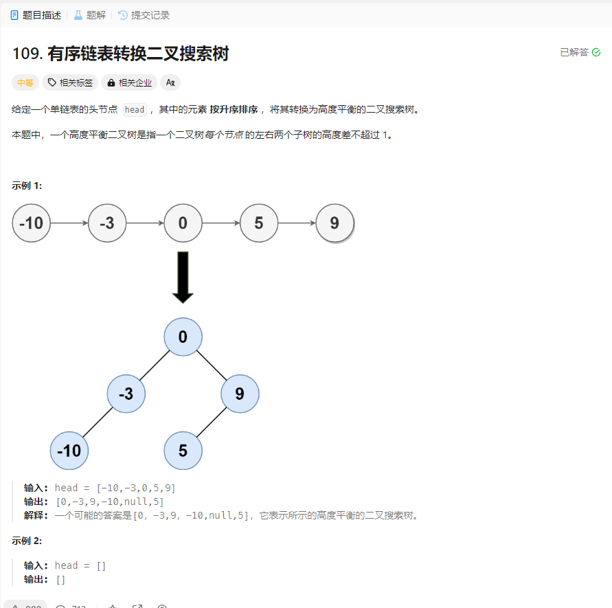

# 109. 有序链表转换二叉搜索树
## 题目链接  
[109. 有序链表转换二叉搜索树](https://leetcode.cn/problems/convert-sorted-list-to-binary-search-tree/description/)
## 题目详情


## 解答一
答题者：EchoBai

### 题解
将链表转为数组，然后根据数组来建立即可。

### 代码
``` cpp
/**
 * Definition for singly-linked list.
 * struct ListNode {
 *     int val;
 *     ListNode *next;
 *     ListNode() : val(0), next(nullptr) {}
 *     ListNode(int x) : val(x), next(nullptr) {}
 *     ListNode(int x, ListNode *next) : val(x), next(next) {}
 * };
 */
/**
 * Definition for a binary tree node.
 * struct TreeNode {
 *     int val;
 *     TreeNode *left;
 *     TreeNode *right;
 *     TreeNode() : val(0), left(nullptr), right(nullptr) {}
 *     TreeNode(int x) : val(x), left(nullptr), right(nullptr) {}
 *     TreeNode(int x, TreeNode *left, TreeNode *right) : val(x), left(left), right(right) {}
 * };
 */
class Solution {
public:
    TreeNode* sortedListToBST(ListNode* head) {
        vector<int> nums;
        ListNode* p = head;
        while(p){
            nums.push_back(p->val);
            p = p->next;
        }
        return sortedArrayToBST(nums);
    }
    TreeNode* sortedArrayToBST(vector<int>& nums) {
        int size = nums.size();
        if(size == 0)  
            return nullptr;
        if(size == 1)
            return new TreeNode(nums[size - 1]);
        TreeNode* root = new TreeNode(nums[size/2]);
        vector<int>left_nums,right_nums;
        for(int i = 0; i < size / 2; ++i){
            left_nums.push_back(nums[i]);
        }
        for(int i = size / 2 + 1; i < size; ++i){
            right_nums.push_back(nums[i]);
        }
        root->left = sortedArrayToBST(left_nums);
        root->right = sortedArrayToBST(right_nums);
        return root;
        
    }
};
```


