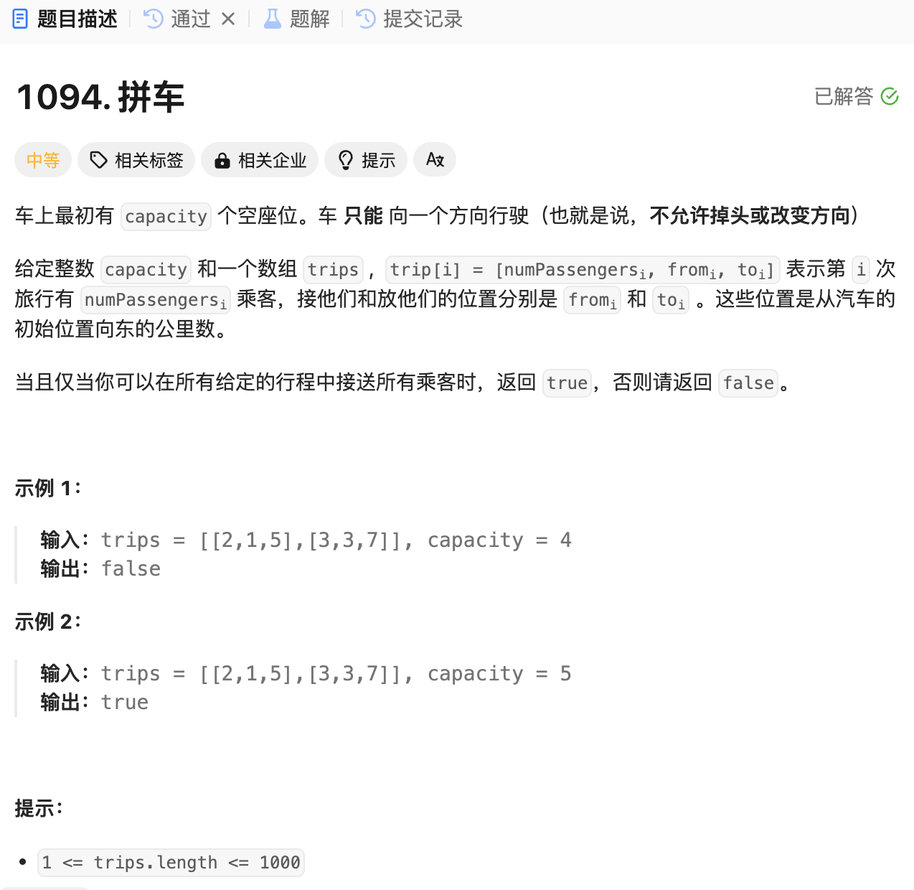

# 1094. 拼车
## 题目链接  
[1094. 拼车](https://leetcode.cn/problems/car-pooling/description/)
## 题目详情


***
## 解答一
答题者：EchoBai

### 题解
创建一个差分数组类，包括构建差分数组，然后对某个区间所有值进行加减，然后根据差分数组得到结果数组。然后分析题目可以看出，其实就是在上下车区间，将乘客数加入数组，需要注意的是，因为乘客在j下车，所以只需要对i，j-1区间进行增加操作即可。最后根据差分数组重建结果，遍历检查在整个过程中有没有超载即可。

### 代码
``` cpp
class DiffUtils {
private:
    int size;
    vector<int> nums;
    vector<int> diff;
public:
    DiffUtils(int _size): size(_size), nums(_size, 0), diff(_size){
        diff[0] = nums[0];
        for(int i = 1; i < size; ++i){
            diff[i] = nums[i] - nums[i-1];
        }
    }
    void inc(int i, int j, int val){
        diff[i] += val;
        if(j + 1 < size){
            diff[j + 1] -= val;
        }
    }
    vector<int> result(){
        vector<int> res(size);
        res[0] = diff[0];
        for(int i = 1; i < size; ++i){
            res[i] = res[i - 1] + diff[i];
        }
        return res;
    }
};

class Solution {
public:
    bool carPooling(vector<vector<int>>& trips, int capacity) {
        DiffUtils utils(1001);
        for(const auto& ele : trips){
            int i = ele[1];
            int j = ele[2] - 1; // in j loctation, the passenger quit, so in range [i, j-1] is valid 
            int val = ele[0];
            utils.inc(i, j, val);
        }

        vector<int> res(utils.result());
        for(const int& i : res){
            if(i > capacity){
                return false;
            }
        }
        return true;
    }
};
```
