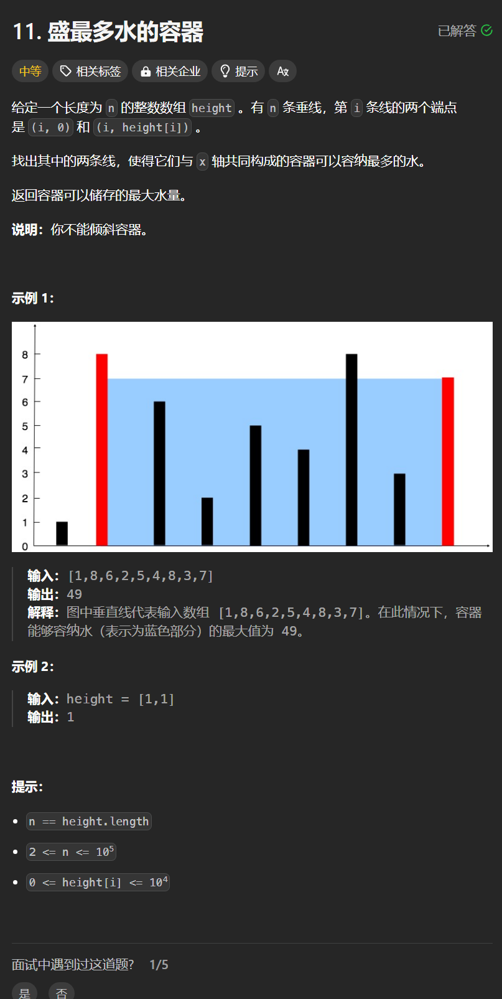

# 11. 盛最多水的容器
## 题目链接  
[11. 盛最多水的容器](https://leetcode.cn/problems/container-with-most-water/description/)
## 题目详情


***
## 解答一
答题者：**Yuiko630**

### 题解
>双指针，初始置于两端，每次移动指向较小的下标，直到重合

### 代码
``` Java
class Solution {
    public int maxArea(int[] height) {
        int left = 0, right = height.length - 1;
        int maxWater = 0;
        while(left < right){
            maxWater = Math.max(Math.min(height[left], height[right]) * (right - left), maxWater);
            if(height[left] <= height[right]) left++;
            else right--;
        }
        return maxWater;
    }
}
```