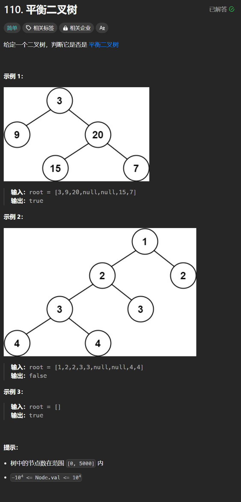

# 110. 平衡二叉树
## 题目链接  
[110. 平衡二叉树](https://leetcode.cn/problems/balanced-binary-tree/description/)
## 题目详情


***
## 解答一
答题者：**Yuiko630**

### 题解
>平衡二叉树的定义时左右子树高度差不超过1，所以可以用递归的方式去判断。

### 代码
``` Java
/**
 * Definition for a binary tree node.
 * public class TreeNode {
 *     int val;
 *     TreeNode left;
 *     TreeNode right;
 *     TreeNode() {}
 *     TreeNode(int val) { this.val = val; }
 *     TreeNode(int val, TreeNode left, TreeNode right) {
 *         this.val = val;
 *         this.left = left;
 *         this.right = right;
 *     }
 * }
 */
class Solution {
    public boolean isBalanced(TreeNode root) {
        return getHeight(root) != -1;
    }
    public int getHeight(TreeNode root){
        if(root == null) return 0;
        int leftDepth = getHeight(root.left);
        if(leftDepth == -1) return -1;
        int rightDepth = getHeight(root.right);
        if(rightDepth == -1) return -1;
        if(Math.abs(leftDepth - rightDepth) > 1) return -1;
        else return Math.max(leftDepth, rightDepth) + 1;
    }
}
```
