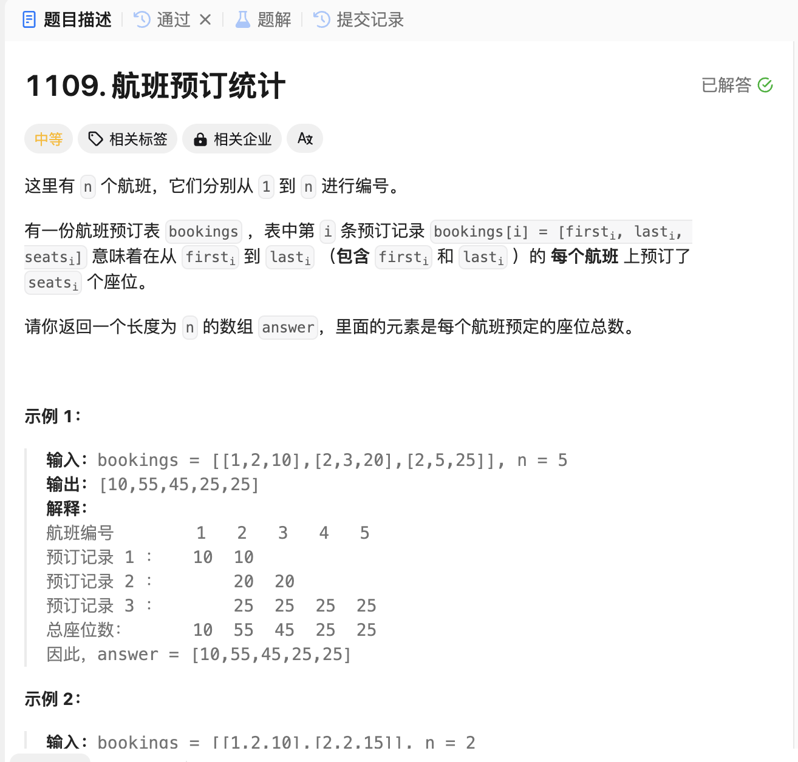

# 1109. 航班预订统计
## 题目链接  
[1109. 航班预订统计](https://leetcode.cn/problems/corporate-flight-bookings/)
## 题目详情


***
## 解答一
答题者：EchoBai

### 题解
创建一个差分数组类，包括构建差分数组，然后对某个区间所有值进行加减，然后根据差分数组得到结果数组。然后分析题目可以看出，其实就是固定区间增加预定票数即可。

### 代码
``` cpp
class DiffUtils {
private:
    int size;
    vector<int> nums;
    vector<int> diff;
public:
    DiffUtils(int _size): size(_size), nums(_size, 0), diff(_size){
        diff[0] = nums[0];
        for(int i = 1; i < size; ++i){
            diff[i] = nums[i] - nums[i-1];
        }
    }
    void inc(int i, int j, int val){
        diff[i] += val;
        if(j + 1 < size){
            diff[j + 1] -= val;
        }
    }
    vector<int> result(){
        vector<int> res(size - 1);
        res[0] = diff[0];
        for(int i = 1; i < size - 1; ++i){
            res[i] = res[i - 1] + diff[i];
        }
        return res;
    }
};

class Solution {
public:
    vector<int> corpFlightBookings(vector<vector<int>>& bookings, int n) {
        DiffUtils* utils = new DiffUtils(n + 1);
        for(const auto& ele : bookings){
            int i = ele[0] - 1;
            int j = ele[1] - 1;
            int val = ele[2];
            utils->inc(i, j, val);
        }
        return utils->result();
    }
};


```
