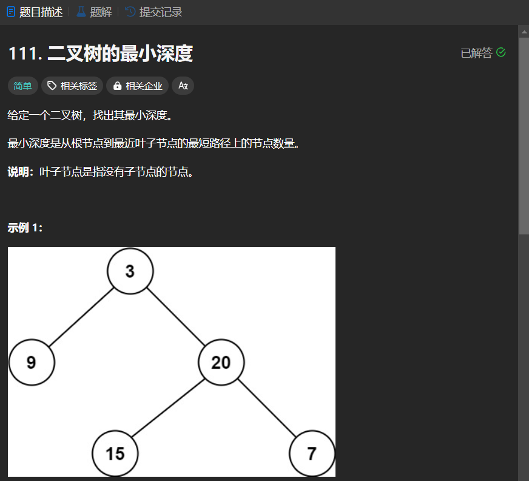

# 111. 二叉树的最小深度
## 题目链接  
[111. 二叉树的最小深度](https://leetcode.cn/problems/minimum-depth-of-binary-tree/description/)
## 题目详情


***
## 解答一
答题者：EchoBai

### 题解
先递归求出左右子树的深度，然后判断是否退化成链表，如果是取其长度加1返回，否则取左右子树最小深度加1返回。

### 代码
``` cpp
/**
 * Definition for a binary tree node.
 * struct TreeNode {
 *     int val;
 *     TreeNode *left;
 *     TreeNode *right;
 *     TreeNode() : val(0), left(nullptr), right(nullptr) {}
 *     TreeNode(int x) : val(x), left(nullptr), right(nullptr) {}
 *     TreeNode(int x, TreeNode *left, TreeNode *right) : val(x), left(left), right(right) {}
 * };
 */
class Solution {
public:
    int minDepth(TreeNode* root) {
        if(!root) return 0;
        int hl = minDepth(root->left);
        int hr = minDepth(root->right);
        if(hl == 0) return ++hr;
        if(hr == 0) return ++hl;
        return min(++hr, ++hl);
    }
};
```

## 解答二
答题者：**Yuiko630**

### 题解
>层序遍历，遍历每一层时深度++，当左右孩子为空时当前深度为最小深度。

### 代码
``` Java
/**
 * Definition for a binary tree node.
 * public class TreeNode {
 *     int val;
 *     TreeNode left;
 *     TreeNode right;
 *     TreeNode() {}
 *     TreeNode(int val) { this.val = val; }
 *     TreeNode(int val, TreeNode left, TreeNode right) {
 *         this.val = val;
 *         this.left = left;
 *         this.right = right;
 *     }
 * }
 */
class Solution {
    public int minDepth(TreeNode root) {
        int depth = 0;
        if(root == null) return depth;
        Queue<TreeNode> queue = new LinkedList<TreeNode>();
        queue.offer(root);
        while(!queue.isEmpty()){
            int count = queue.size();
            depth++;
            for(int i = 0; i < count; i++){
                TreeNode cur = queue.poll();
                if(cur.left == null && cur.right == null ) return depth;
                if(cur.left != null) queue.offer(cur.left);
                if(cur.right != null) queue.offer(cur.right);
            }
        }
        return depth;
    }
}
```
