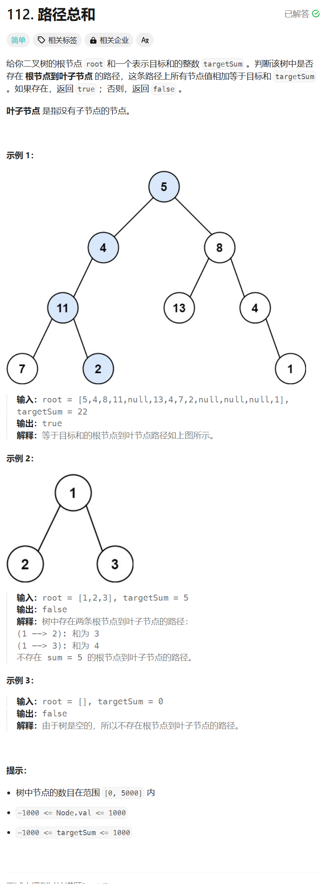

# 112. 路径总和
## 题目链接  
[112. 路径总和](https://leetcode.cn/problems/path-sum/description/)
## 题目详情


***
## 解答一
答题者：**Yuiko630**

### 题解
>递归判断，如果是叶子节点，则当前路径和=目标总和-当前值。

### 代码
``` Java
/**
 * Definition for a binary tree node.
 * public class TreeNode {
 *     int val;
 *     TreeNode left;
 *     TreeNode right;
 *     TreeNode() {}
 *     TreeNode(int val) { this.val = val; }
 *     TreeNode(int val, TreeNode left, TreeNode right) {
 *         this.val = val;
 *         this.left = left;
 *         this.right = right;
 *     }
 * }
 */
class Solution {
    public boolean hasPathSum(TreeNode root, int targetSum) {
        if(root == null) return false;
        if(root.left == null && root.right == null) return root.val == targetSum;
        return hasPathSum(root.left, targetSum - root.val) || hasPathSum(root.right, targetSum - root.val);
    }
}
```


