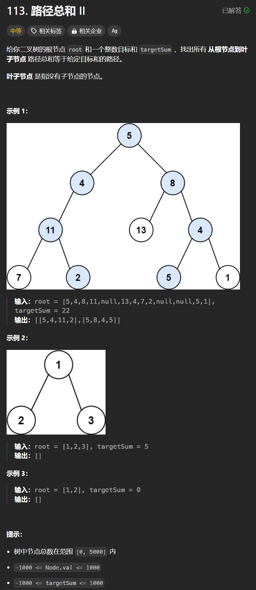

# 113. 路径总和II
## 题目链接  
[113. 路径总和II](https://leetcode.cn/problems/path-sum-ii/description/)
## 题目详情


***
## 解答一
答题者：**Yuiko630**

### 题解
>递归判断，如果是叶子节点，则当前路径和=目标总和-当前值，注意保存path时必须新建对象，结束递归下一步是回溯，即从path中移除最后一个元素。

### 代码
``` Java
/**
 * Definition for a binary tree node.
 * public class TreeNode {
 *     int val;
 *     TreeNode left;
 *     TreeNode right;
 *     TreeNode() {}
 *     TreeNode(int val) { this.val = val; }
 *     TreeNode(int val, TreeNode left, TreeNode right) {
 *         this.val = val;
 *         this.left = left;
 *         this.right = right;
 *     }
 * }
 */
class Solution {
    List<List<Integer>> result = new ArrayList<List<Integer>>();
    public void traverse(TreeNode root, int target, List<Integer> path){
        path.add(root.val);
        if(root.left == null && root.right == null && target == root.val) {
            result.add(new ArrayList<>(path));
        }
        if(root.left != null) {
            traverse(root.left, target - root.val, path);
            path.remove(path.size()-1);
        }
        if(root.right != null){
            traverse(root.right, target - root.val, path);
            path.remove(path.size()-1);
        }
    }
    public List<List<Integer>> pathSum(TreeNode root, int targetSum) {
        if(root == null) return result;
        List<Integer> path = new ArrayList<Integer>();
        traverse(root, targetSum, path);
        return result;
    }
}
```

***
## 解答二
答题者：**EchoBai**

### 题解
>递归判断，如果是叶子节点，则当前路径和=目标总和-当前值，注意保存path时必须新建对象，结束递归下一步是回溯，即从path中移除最后一个元素。

### 代码
``` c++
/**
 * Definition for a binary tree node.
 * struct TreeNode {
 *     int val;
 *     TreeNode *left;
 *     TreeNode *right;
 *     TreeNode() : val(0), left(nullptr), right(nullptr) {}
 *     TreeNode(int x) : val(x), left(nullptr), right(nullptr) {}
 *     TreeNode(int x, TreeNode *left, TreeNode *right) : val(x), left(left), right(right) {}
 * };
 */
class Solution {
    vector<vector<int>> res;
    vector<int> path;
public:
    vector<vector<int>> pathSum(TreeNode* root, int targetSum) {
        backtracking(root, targetSum);
        return res;
    }

    void backtracking(TreeNode* root, int targetSum){
        if(!root) return;
        path.push_back(root->val);
        if (!root->left && !root->right && root->val == targetSum) {
            res.push_back(path);
        } else {
            backtracking(root->left, targetSum - root->val);
            backtracking(root->right, targetSum - root->val);
        }
        path.pop_back();
        
    }
};
```