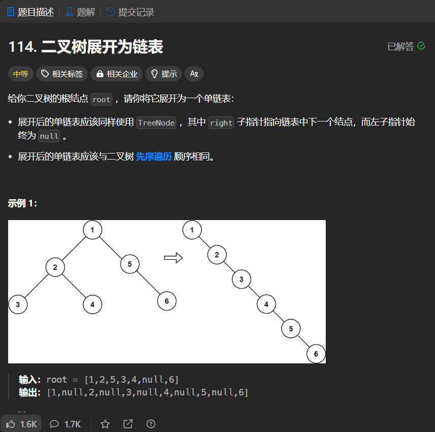

# 114. 二叉树展开为链表
## 题目链接  
[114. 二叉树展开为链表](https://leetcode.cn/problems/flatten-binary-tree-to-linked-list/description/)
## 题目详情


***
## 解答一
答题者：EchoBai

### 题解
使用一个`vector`将链表节点信息`ListNode*`以前序遍历的顺序放入，最后在重新组合链表即可。

### 代码
``` cpp
/**
 * Definition for a binary tree node.
 * struct TreeNode {
 *     int val;
 *     TreeNode *left;
 *     TreeNode *right;
 *     TreeNode() : val(0), left(nullptr), right(nullptr) {}
 *     TreeNode(int x) : val(x), left(nullptr), right(nullptr) {}
 *     TreeNode(int x, TreeNode *left, TreeNode *right) : val(x), left(left), right(right) {}
 * };
 */
class Solution {
public:
    void flatten(TreeNode* root) {
        vector<TreeNode*>res;
        TreeNode* ans = new TreeNode();
        preorder(root,res);
        for(auto e : res){
            e->left = nullptr;
            e->right = nullptr;
            ans->right = e;
            ans->left = nullptr;
            ans = ans->right;
        }
        root = ans->right;
    }
    void preorder(TreeNode* root, vector<TreeNode*> &res){
        if(!root) return;
        res.push_back(root);
        preorder(root->left,res);
        preorder(root->right,res);
    }
};
```


