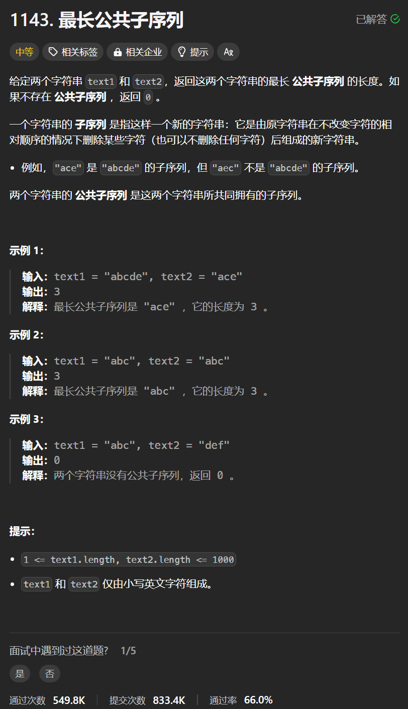

# 1143. 最长公共子序列
## 题目链接  
[1143. 最长公共子序列](https://leetcode.cn/problems/longest-common-subsequence/description/)
## 题目详情


***
## 解答一
答题者：**Yuiko630**

### 题解
>定义:dp[i][j]表示包括i-1在内的A与包括j-1在内的B最长公共子序列长度
>2. 转移方程:if(A[i-1] == B[j-1]) dp[i][j] = dp[i][j]+1; //上一长度+1
else dp[i][j] = max(dp[i-1][j], dp[i][j-1]); // 回退上一最大
>3. 初始化:均为0
>4. 遍历:外层循环i从1-A.length，内层循环从1-B.length
>5. 推导

### 代码
``` Java
class Solution {
    public int longestCommonSubsequence(String text1, String text2) {
        int[][] dp = new int[text1.length()+ 1][text2.length()+1];
        for(int i = 1; i <= text1.length(); i++){
            for(int j = 1; j <= text2.length(); j++){
                if(text1.charAt(i-1) == text2.charAt(j-1)) dp[i][j] = dp[i-1][j-1] + 1;
                else dp[i][j] = Math.max(dp[i-1][j], dp[i][j-1]);
            }
        }
        return dp[text1.length()][text2.length()];
    }
}
```