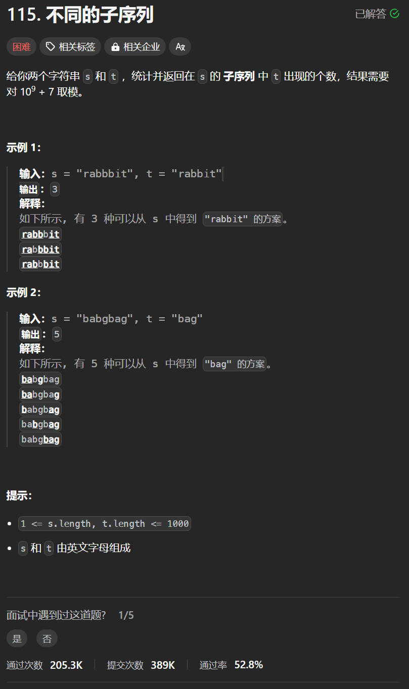

# 115. 不同的子序列
## 题目链接  
[115. 不同的子序列](https://leetcode.cn/problems/distinct-subsequences/description/)
## 题目详情


***
## 解答一
答题者：**Yuiko630**

### 题解
>定义:dp[i][j]表示包括i-1的s和包括j-1的t的不同子序列个数
>2. 转移方程:if(s[i] == t[j]) dp[i][j] = dp[i-1][j-1]+dp[i-1][j]; // 匹配上的个数=继承前面+不使用s[i-1]匹配的个数
else dp[i][j] = dp[i-1][j]，匹配不上回退s一个字符
>3. 初始化:dp[i][0]全为1表示任何位置都有空字符串，dp[0][j]全为0即可，表示空串里不可能含t
>4. 遍历:外层循环i从1-s.length，内层循环j从1-t.length
>5. 推导

### 代码
``` Java
class Solution {
    public int numDistinct(String s, String t) {
        int[][] dp = new int[s.length() + 1][t.length()+1];
        for(int i = 0; i < s.length(); i++){
            dp[i][0] = 1;
        }
        for(int i = 1; i <= s.length(); i++){
            for(int j = 1; j <= t.length(); j ++){
                if(s.charAt(i-1) == t.charAt(j-1)) dp[i][j] = dp[i-1][j-1] + dp[i-1][j];
                else dp[i][j] = dp[i-1][j];
            }
        }
        return dp[s.length()][t.length()];
    }
}
```