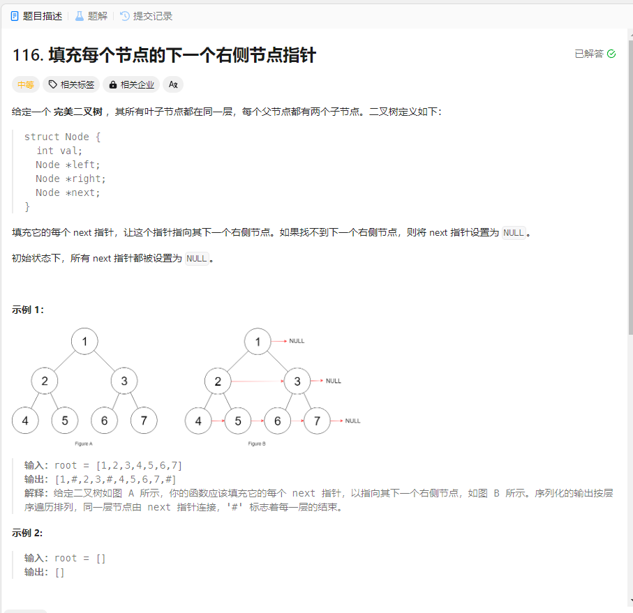

# 116. 填充每个节点的下一个右侧节点指针
## 题目链接  
[116. 填充每个节点的下一个右侧节点指针](https://leetcode.cn/problems/populating-next-right-pointers-in-each-node/description/)
## 题目详情


## 解答一
答题者：EchoBai

### 题解
通过层序遍历依次将每层的每个节点的`next`指针指到正确的位置上。

### 代码
``` cpp
/*
// Definition for a Node.
class Node {
public:
    int val;
    Node* left;
    Node* right;
    Node* next;

    Node() : val(0), left(NULL), right(NULL), next(NULL) {}

    Node(int _val) : val(_val), left(NULL), right(NULL), next(NULL) {}

    Node(int _val, Node* _left, Node* _right, Node* _next)
        : val(_val), left(_left), right(_right), next(_next) {}
};
*/

class Solution {
public:
    Node* connect(Node* root) {
        levelOrder(root);
        return root;
    }
    void levelOrder(Node* &root){
        if(!root) return;
        queue<Node*> q;
        q.push(root);
        while(!q.empty()){
            int num = q.size();
            if(num == 1){
                Node* e = q.front();
                q.pop();
                e->next = NULL;
                if(e->left) q.push(e->left);
                if(e->right) q.push(e->right);
            }else {
                Node* pre = q.front();
                q.pop();
                if(pre->left) q.push(pre->left);
                if(pre->right) q.push(pre->right);
                for(int i = num - 1; i > 0; --i){
                    Node* e = q.front();
                    e->next = NULL;
                    pre->next = e;
                    pre = e;
                    q.pop();
                    if(e->left) q.push(e->left);
                    if(e->right) q.push(e->right);
                }
            }
        }
    } 
};
```


