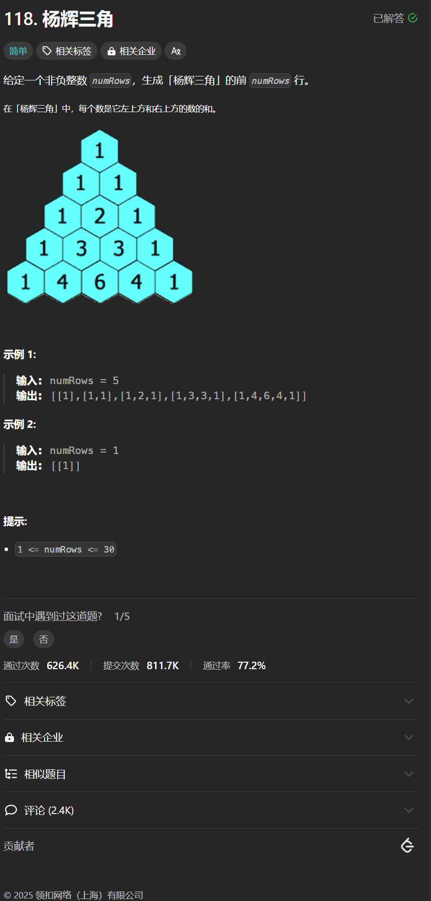

# 118. 杨辉三角
## 题目链接  
[118. 杨辉三角](https://leetcode.cn/problems/ascals-triangle/description/?envType=study-plan-v2&envId=top-interview-150)
## 题目详情


## 解答一
答题者：**Yuiko630**

### 题解
>第i行第1个和第i个都是1，第j个是第i-1行的第j-1个+第i-1行的第j个。

### 代码
``` java
class Solution {
    public List<List<Integer>> generate(int numRows) {
        ArrayList<List<Integer>> res = new ArrayList<>();
        for(int i = 0; i < numRows; i++){
            ArrayList<Integer> row = new ArrayList<>();
            // 一共要生成i+1个数字
            for(int j = 0; j < i+1; j++){
                if(j == 0 || j == i){
                    row.add(1);
                }
                else{
                    row.add(res.get(i-1).get(j-1) + res.get(i-1).get(j));
                }
            }
            res.add(row);
        }
        return res;
    }
}
```
>标准dp的写法
```java
class Solution {
    public List<List<Integer>> generate(int numRows) {
        Integer[][] dp = new Integer[numRows][];
        for(int i = 0; i < numRows; i++){
            dp[i] = new Integer[i+1];
            dp[i][0] = 1;
            dp[i][i] = 1;
            for(int j = 1; j < i; j ++){
                dp[i][j] = dp[i-1][j-1] + dp[i-1][j];
            }
        }
        ArrayList<List<Integer>> result = new ArrayList<>();
        for(Integer[] row : dp){
            result.add(Arrays.asList(row));
        }
        return result;
    }
}
```