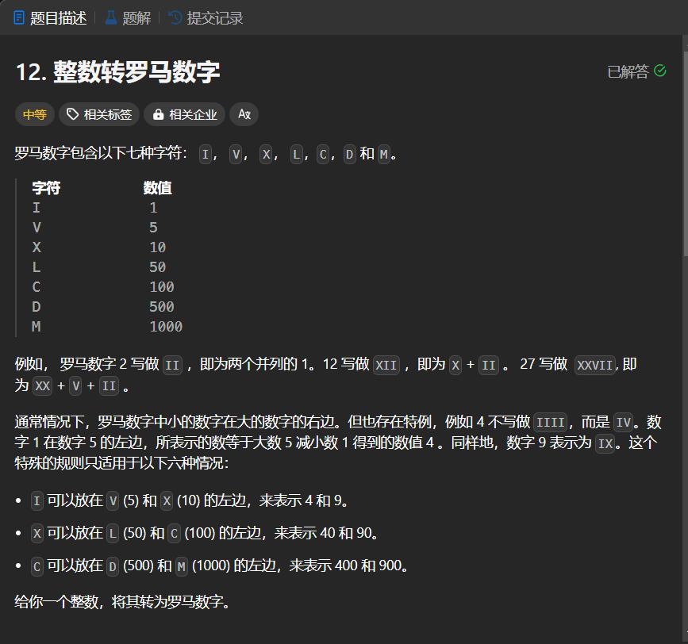

# 12. 整数转罗马数字
## 题目链接  
[12. 整数转罗马数字](https://leetcode.cn/problems/integer-to-roman/description/)
## 题目详情


***
## 解答一
答题者：EchoBai

### 题解
拆分出各个位数，然后分情况讨论即可。只是代码有点繁琐，还需优化。

### 代码
``` cpp
class Solution {
public:
    string intToRoman(int num) {
        string res;
        int bit4 = num / 1000;
        int bit3 = num % 1000 / 100;
        int bit2 = num % 1000 % 100 / 10;
        int bit1 = num - 1000 * bit4 - 100 * bit3 - 10 * bit2;
        cout << bit4 << bit3 << bit2 << bit1 << endl;
        if(bit4 != 0){
            for(int i = 0; i < bit4; ++i)
                res.push_back('M');
        }
        if(bit3 != 0){
            if(bit3 <= 3){
                for(int i = 0; i < bit3; ++i)
                    res.push_back('C');
            }
            else if(bit3 == 4){
                res.push_back('C');
                res.push_back('D');
            }else {
                if(bit3 == 9){
                    res.push_back('C');
                    res.push_back('M');
                }else{
                    res.push_back('D');
                    for(int i = 0; i < bit3 - 5; ++i)
                        res.push_back('C');
                }
            }
        }
        if(bit2 != 0){
            if(bit2 <= 3){
                for(int i = 0; i < bit2; ++i)
                    res.push_back('X');
            }
            else if(bit2 == 4){
                res.push_back('X');
                res.push_back('L');
            }else {
                if(bit2 == 9){
                    res.push_back('X');
                    res.push_back('C');
                }else{
                    res.push_back('L');
                    for(int i = 0; i < bit2 - 5; ++i)
                        res.push_back('X');
                }
            }
        }
        if(bit1 != 0){
            if(bit1 <= 3){
                for(int i = 0; i < bit1; ++i)
                    res.push_back('I');
            }
            else if(bit1 == 4){
                res.push_back('I');
                res.push_back('V');
            }else {
                if(bit1 == 9){
                    res.push_back('I');
                    res.push_back('X');
                }else{
                    res.push_back('V');
                    for(int i = 0; i < bit1 - 5; ++i)
                        res.push_back('I');
                }
            }
        }

        return res;
    }
};
```