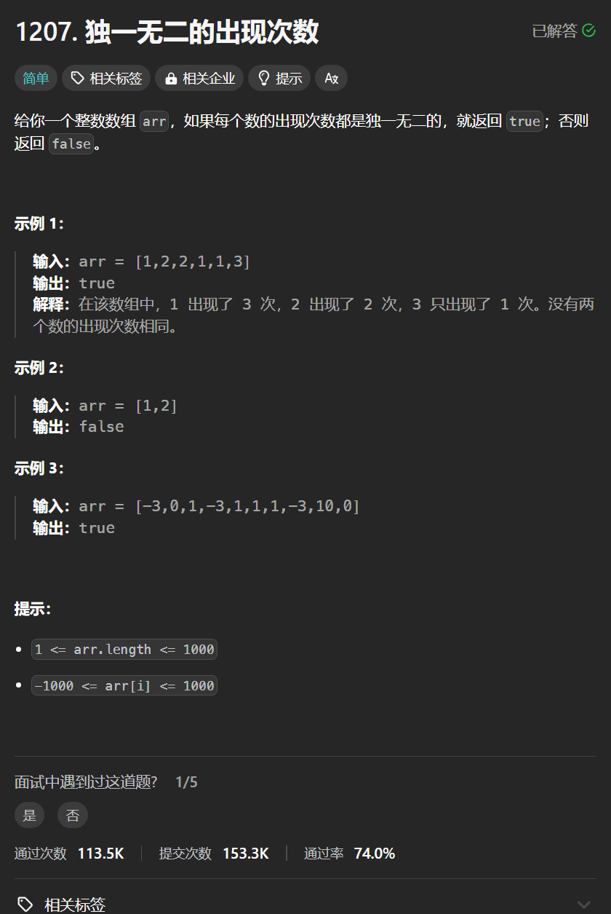

# 1207. 独一无二的出现次数
## 题目链接  
[1207. 独一无二的出现次数](https://leetcode.cn/problems/unique-number-of-occurrences/description/)
## 题目详情


***
## 解答一
答题者：**Yuiko630**

### 题解
>一个map统计数字及其出现次数，一个map装出现次数及其数字。

### 代码
``` Java
class Solution {
    public boolean uniqueOccurrences(int[] arr) {
        Map<Integer, Integer> map = new HashMap<>();
        Map<Integer, Integer> count = new HashMap<>();
        for(int i = 0; i < arr.length; i++){
            map.put(arr[i], map.getOrDefault(arr[i], 0) + 1);
        }
        for (Map.Entry<Integer, Integer> entry : map.entrySet()) {
            if(count.containsKey(entry.getValue())) return false;
            else count.put(entry.getValue(), entry.getKey());
        }
        return true;
    }
}
```