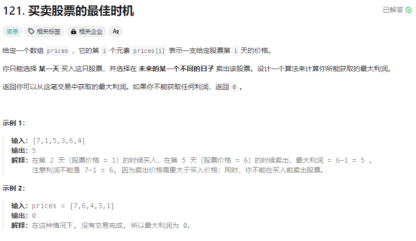

# 121. 购买股票的最佳时机 
## 题目链接  
[链接](https://leetcode.cn/problems/best-time-to-buy-and-sell-stock/?envType=study-plan-v2&envId=top-interview-150)
## 题目详情


***
## 解答一
答题者：** Curtis **
### 代码
``` cpp
class Solution {
public:
    int maxProfit(vector<int>& prices) {
        if(prices.size()==0){
            return 0;
        }
        int curMaxNum = 0;
        int curMinPos = 0;
        for(int i = 1;i < prices.size();i++){
            if(prices[i]<prices[curMinPos]){
                curMinPos = i;
                continue;
            }
            int diff = prices[i] - prices[curMinPos];
            if(curMaxNum<diff){
                curMaxNum = diff;
            }
        }
        return curMaxNum;
    }
};
```

### 题解

>从头开始搜索，记录当前最大和最大时候的最低股票购入值，当出现与最低的差值更大的时候，则更换记录的最大值，如果出现更低的股票购入值，则更改记录的最低股票购入值，但是最大差值仍保持不变，最后可以进行一次遍历就可以获取最大的插值