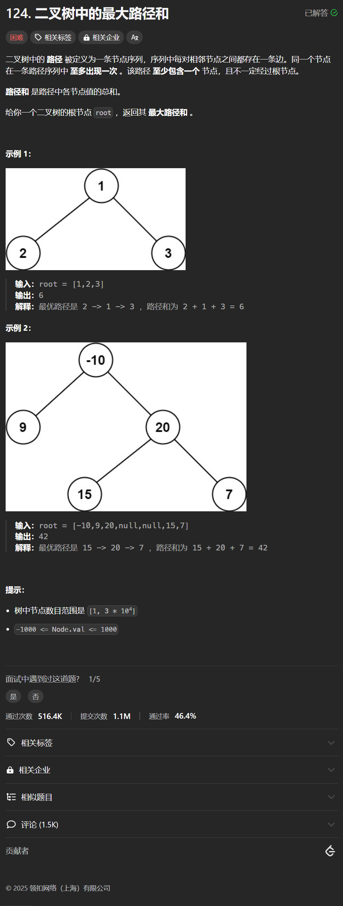

# 124. 二叉树中的最大路径和
## 题目链接  
[124. 二叉树中的最大路径和](https://leetcode.cn/problems/best-time-to-buy-and-sell-stock/?envType=study-plan-v2&envId=top-interview-150)
## 题目详情


***
## 解答一
答题者：**Yuiko630**

### 题解
>每个节点的权值可以表示为左+中+右，其中左和右得取左子树和右子树比0大的时候，如果权值>最大值，则更新最大值，向上传递时由于路径是单向的，所以只能return取中+max(左，右)。

### 代码
``` Java
/**
 * Definition for a binary tree node.
 * public class TreeNode {
 *     int val;
 *     TreeNode left;
 *     TreeNode right;
 *     TreeNode() {}
 *     TreeNode(int val) { this.val = val; }
 *     TreeNode(int val, TreeNode left, TreeNode right) {
 *         this.val = val;
 *         this.left = left;
 *         this.right = right;
 *     }
 * }
 */
class Solution {
    int result = Integer.MIN_VALUE;
    public int maxPathSum(TreeNode root) {
        maxValue(root);
        return result;
    }
    public int maxValue(TreeNode node){
        if(node == null) return 0;
        int valPath = node.val;
        int leftVal = Math.max(maxValue(node.left), 0);
        int rightVal = Math.max(maxValue(node.right), 0);
        if(leftVal > 0) {
            valPath += leftVal;
        }
        if(rightVal > 0){
            valPath += rightVal;
        }
        if(valPath > result) result = valPath;
        return node.val + Math.max(leftVal, rightVal);
    }
}
```
