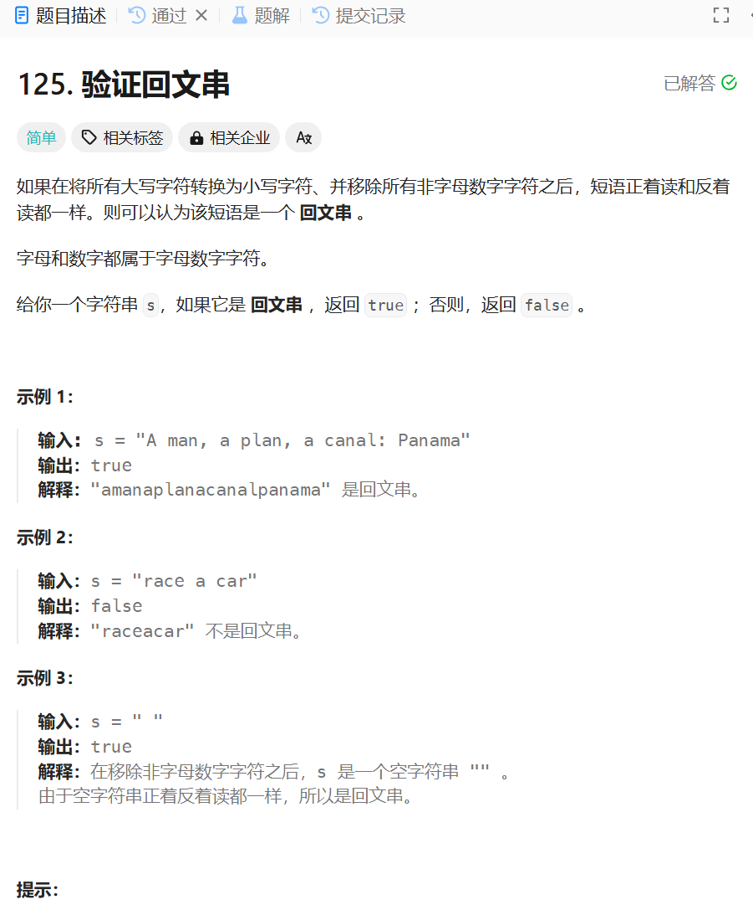

# 125. 验证回文串
## 题目链接  
[125. 验证回文串](https://leetcode.cn/problems/best-time-to-buy-and-sell-stock/?envType=study-plan-v2&envId=top-interview-150)
## 题目详情


***
## 解答一
答题者：**Yuiko630**

### 题解
>利用.replaceAll("[^0-9a-zA-Z]","").toLowerCase()去除其他字符并小写，然后头尾对比。

### 代码
``` Java
class Solution {
    public boolean isPalindrome(String s) {
        s = s.replaceAll("[^0-9a-zA-Z]","").toLowerCase();
        for(int i = 0; i < s.length() / 2; i++){
            if(s.charAt(i) != s.charAt(s.length() - i - 1)){
                return false;
            }
        }
        return true;
    }
}
```
