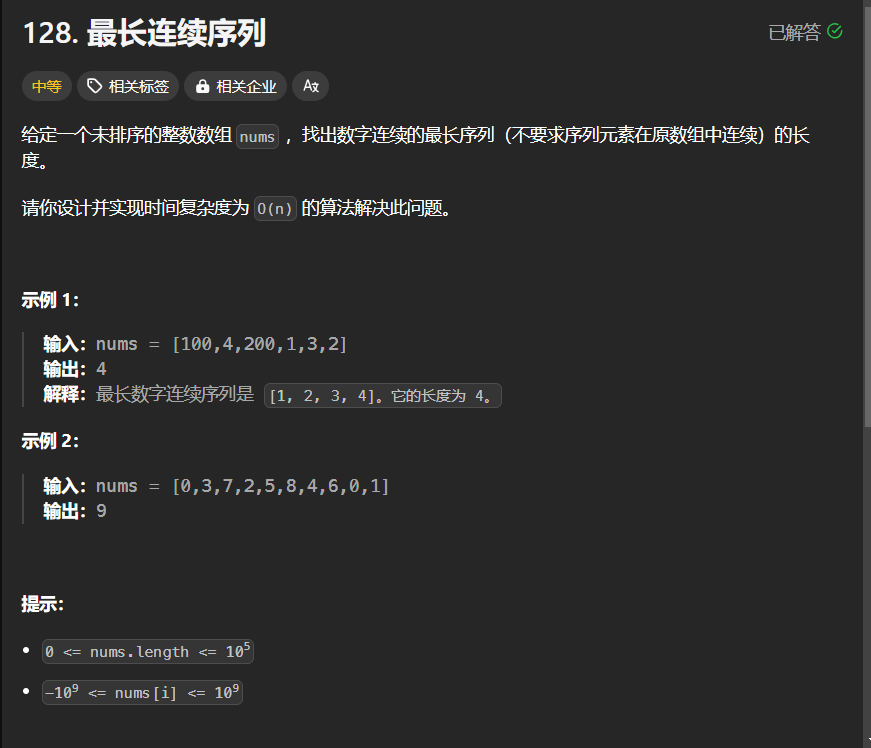

# 128. 最长连续序列
## 题目链接  
[128. 最长连续序列](https://leetcode.cn/problems/longest-consecutive-sequence/description/?envType=study-plan-v2&envId=top-interview-150)
## 题目详情


***
## 解答一
答题者：EchoBai

### 题解
根据题意，首先对于长度小于1的序列，直接返回即可，考虑一个连续序列，那么很容易想到的是对其进行排序，之后看连续元素之间的关系，即后一个元素加一是否等于前一个元素，需要注意的是此处给的序列并不是严格单调的，因此出现相同元素的情况我们需要进行跳过。

### 代码
``` cpp
class Solution {
public:
    int longestConsecutive(vector<int>& nums) {
        int size = nums.size();
        if(size <= 1)
            return size;
        sort(nums.begin(),nums.end());
        int len = 1;
        int maxlen = 1;
        for(int i = 1; i < size; ++i){
            if(nums[i-1] + 1 == nums[i]){
                ++len;
            }else if(nums[i - 1] == nums[i]){
                continue;
            }else{
                len = 1;
            }
            maxlen = max(len,maxlen);
        }
        return maxlen;
    }
};
```

## 解答二
答题者：Yuiko630

### 题解
>哈希表，将所有数放进set去重，遍历每个数如果不存在前一个数，则一直尝试加后一个数的长度，与最长长度做比较。

### 代码
``` Java
class Solution {
    public int longestConsecutive(int[] nums) {
        Set<Integer> set = new HashSet<>();
        for(int num:nums){
            set.add(num);
        }
        int maxLength = 0;
        for(int num:set){
            if(!set.contains(num-1)){
                int length = 1;
                while(set.contains(num+length)){
                    length++;
                }
                maxLength = Math.max(maxLength, length);
            }
        }
        return maxLength;
    }
}
```