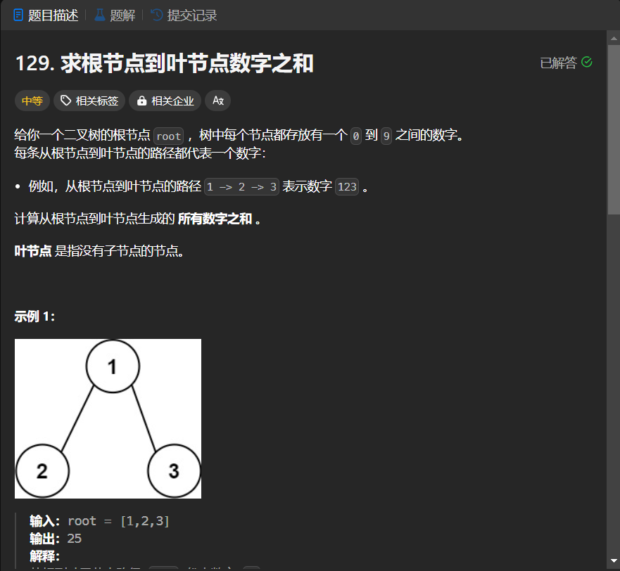

# 129. 求根节点到叶节点数字之和
## 题目链接  
[129. 求根节点到叶节点数字之和](https://leetcode.cn/problems/sum-root-to-leaf-numbers/?envType=study-plan-v2&envId=top-interview-150)
## 题目详情


***
## 解答一
答题者：EchoBai

### 题解
递归求解即可。

### 代码
``` cpp
/**
 * Definition for a binary tree node.
 * struct TreeNode {
 *     int val;
 *     TreeNode *left;
 *     TreeNode *right;
 *     TreeNode() : val(0), left(nullptr), right(nullptr) {}
 *     TreeNode(int x) : val(x), left(nullptr), right(nullptr) {}
 *     TreeNode(int x, TreeNode *left, TreeNode *right) : val(x), left(left), right(right) {}
 * };
 */
class Solution {
public:
    int sumNumbers(TreeNode* root){
        return dfs(root,0);
    }
    int dfs(TreeNode* root,int sum){
        if(!root) return 0;
        sum = sum * 10 + root->val;
        if(!root->left && !root->right)
            return sum;
        else{
            return dfs(root->left,sum) + dfs(root->right,sum);
        }
    }
};
```


