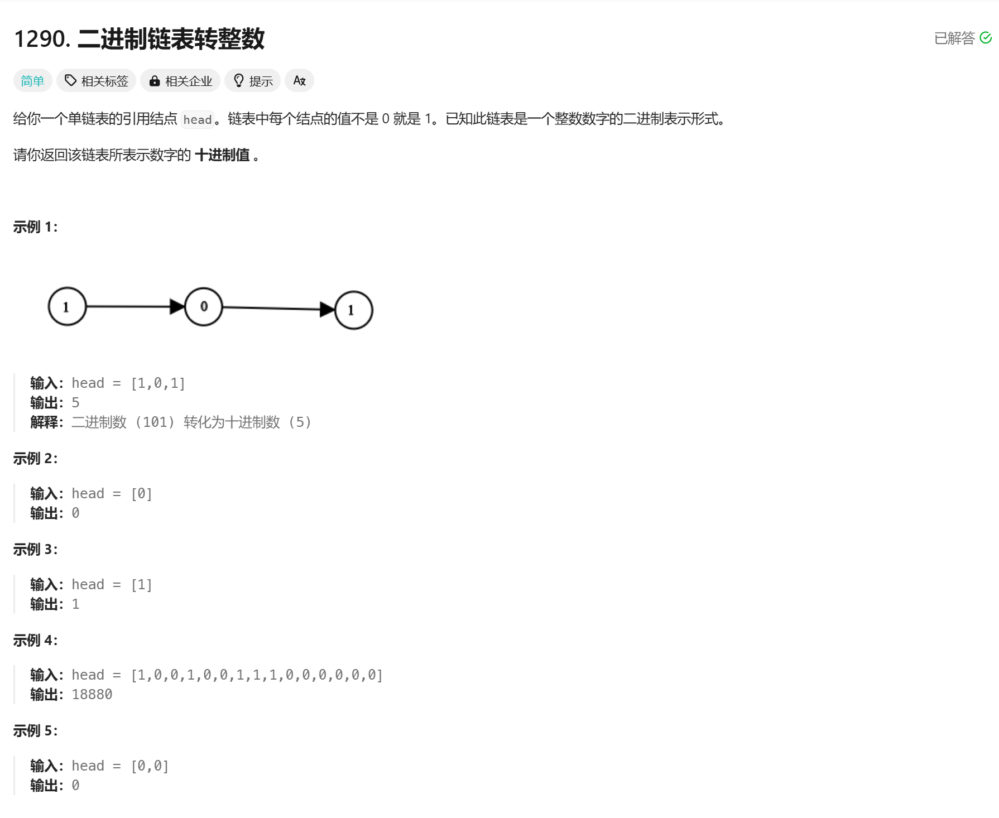

# 1290. 二进制链表转整数
## 题目链接  
[1290. 二进制链表转整数](https://leetcode.cn/problems/convert-binary-number-in-a-linked-list-to-integer/description/)
## 题目详情


***
## 解答一
答题者：EchoBai

### 题解
放入数组，计算即可。

### 代码
``` cpp
/**
 * Definition for singly-linked list.
 * struct ListNode {
 *     int val;
 *     ListNode *next;
 *     ListNode() : val(0), next(nullptr) {}
 *     ListNode(int x) : val(x), next(nullptr) {}
 *     ListNode(int x, ListNode *next) : val(x), next(next) {}
 * };
 */
class Solution {
public:
    int getDecimalValue(ListNode* head) {
        ListNode* p = head;
        std::vector<int> vt;
        while(p){
            vt.emplace_back(p->val);
            p = p->next;
        }

        int j = 0;
        int sum = 0;
        for(int i = vt.size() - 1; i >= 0; --i){
            sum += (pow(2,j)*vt[i]);
            ++j;
        }
        return sum;
    }
};
```
