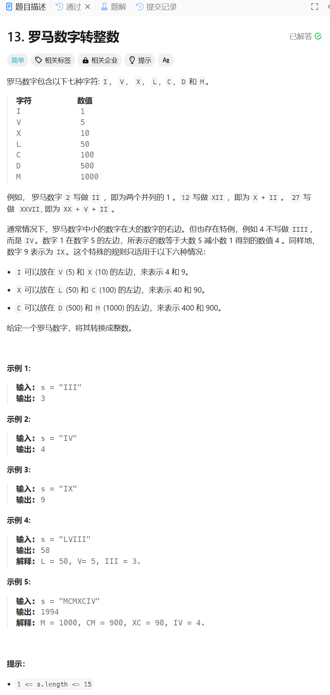

# 13. 罗马数字转整数
## 题目链接  
[13. 罗马数字转整数](https://leetcode.cn/problems/roman-to-integer/description/)
## 题目详情


***
## 解答一
答题者：**Yuiko630**

### 题解
>因为存在例如IV表示4，则需要比较当前和下一个，如果当前小于下一个则减去当前值，否则加上即可，注意最后一个符号单独加上。用map来保存符号对应的数值。

### 代码
``` Java
class Solution {
    public int romanToInt(String s) {
        int sum = 0;
        int n = s.length();
        if(n == 0) return 0;
        Map<Character, Integer> myMap = new HashMap<Character, Integer>();
        myMap.put('I', 1);
        myMap.put('V', 5);
        myMap.put('X', 10);
        myMap.put('L', 50);
        myMap.put('C', 100);
        myMap.put('D', 500);
        myMap.put('M', 1000);
        for(int i = 0; i < n - 1; i++){
            int value = myMap.get(s.charAt(i));
            int nextValue = myMap.get(s.charAt(i+1));
            if(value >= nextValue){
                sum += value;
            }
            else{
                sum -= value;
            }
        }
        sum += myMap.get(s.charAt(n - 1));
        return sum;
    }
}
```