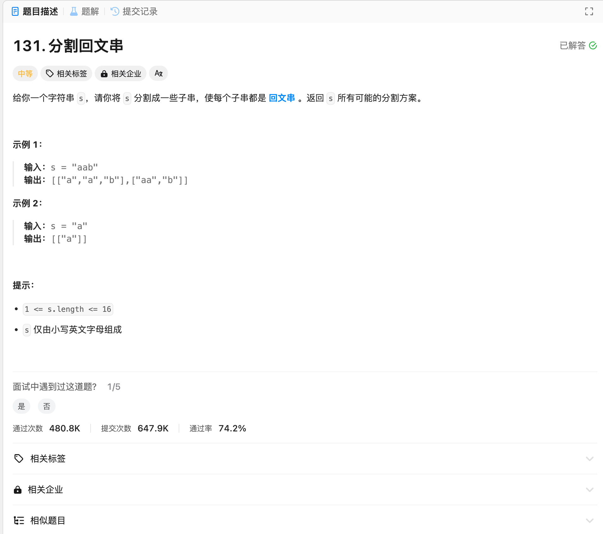

# 131. 分割回文串
## 题目链接  
[131. 分割回文串](https://leetcode.cn/problems/palindrome-partitioning/)
## 题目详情


***
## 解答一
答题者：EchoBai

### 题解
切割问题，回溯法。终止条件就是当前遍历位置以及到字符串末尾。先判断是否是回文串（双指针），然后在入栈该子串到vector中，不是回文串的分割直接跳过。

### 代码
``` cpp
class Solution {
    vector<vector<string>> res;
    vector<string> str;
public:
    vector<vector<string>> partition(string s) {
        backtracking(s,0);
        return res;
    }

    void backtracking(string s, int startIdx){
        if(startIdx >= s.size()){
            res.push_back(str);
            return;
        }
        for(int i = startIdx; i < s.length(); ++i){
             string tmp = s.substr(startIdx, i - startIdx + 1);
            if(isPalindrome(tmp)){
                str.push_back(tmp);
            }else{
                continue;
            }
            backtracking(s, i + 1);
            str.pop_back();
        }
    }

    bool isPalindrome(string str) {
        int left = 0;
        int right = str.length() - 1;
        while(left < right){
            if(str[left] != str[right]){
                return false;
            }
            ++left;
            --right;
        }
        return true;
    }
};
```
