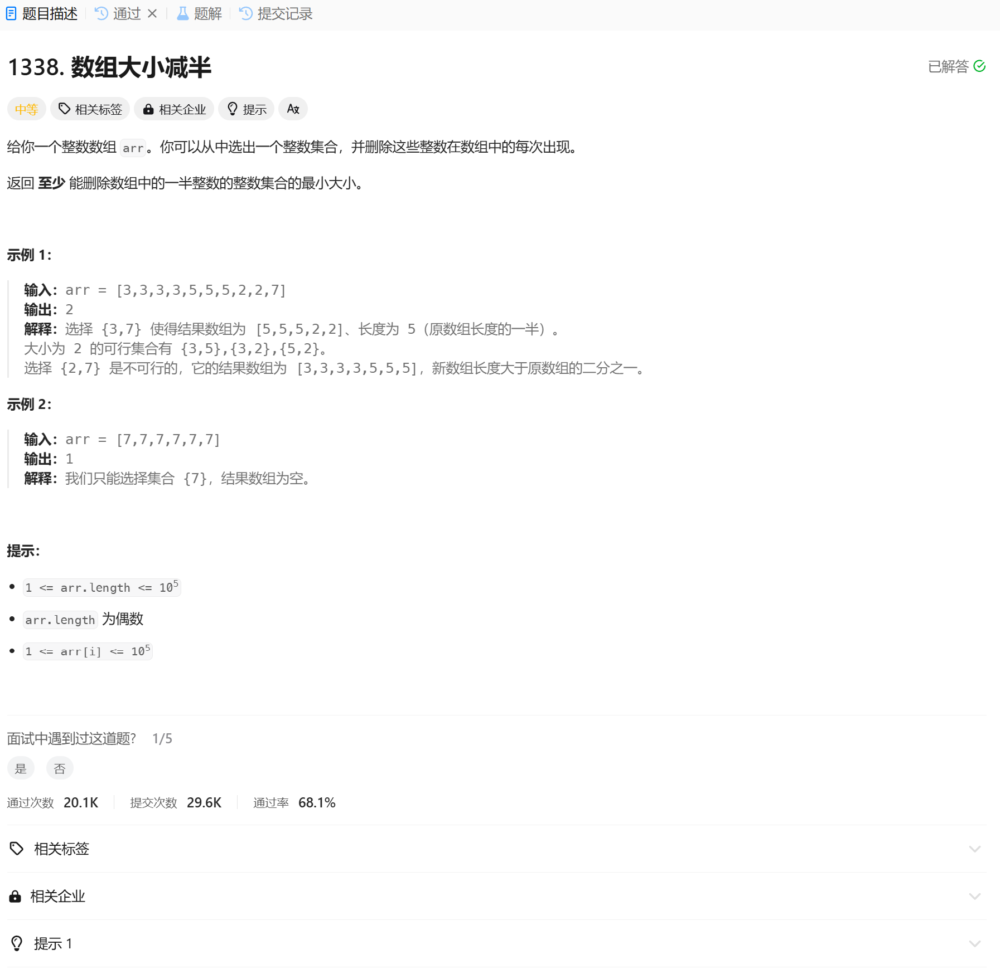

# 1338. 数组大小减半
## 题目链接  
[1338. 数组大小减半](https://leetcode.cn/problems/reduce-array-size-to-the-half/description/?envType=daily-question&envId=2024-12-15)
## 题目详情


***
## 解答一
答题者：EchoBai

### 题解
统计每个元素出现的次数，然后按次数从大到小排序，依次累加次数，当次数大于或等于数组一半长度时，返回当前遍历位置即可。

### 代码
``` cpp
class Solution {
public:
    int minSetSize(vector<int>& arr) {
        int size = arr.size(); 
        std::vector<int> vt;
        std::map<int,int> mp;
        for(const auto& e : arr){
            ++mp[e];
        }
        for(const auto& [val, cnt] : mp){
            vt.push_back(cnt);
        }
        ranges::sort(vt, greater());

        int arrSize = 0;
        for(int i = 0; i < vt.size(); ++i){
            arrSize += vt[i];
            if(arrSize >= size / 2){
                return i + 1;
            }
        }
        return 1;
    }
};
```
