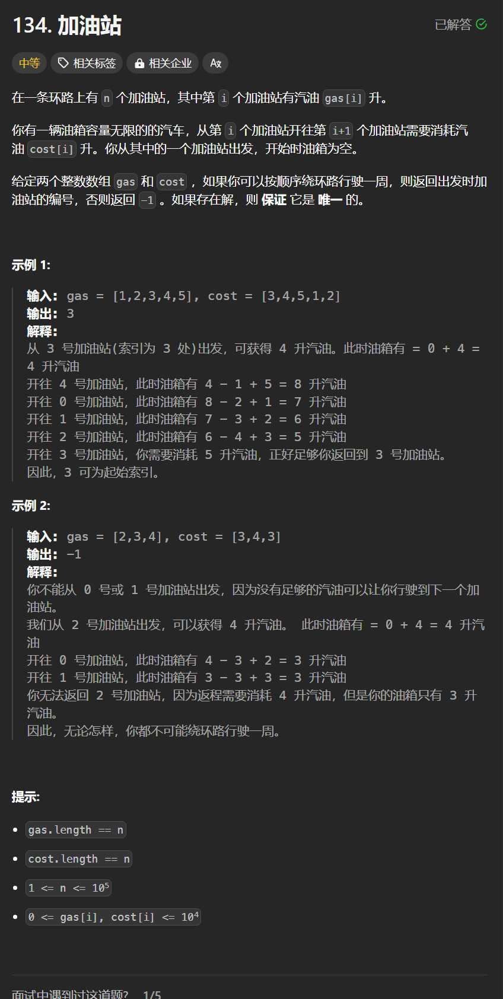

# 134. 加油站
## 题目链接  
[134. 加油站](https://leetcode.cn/problems/gas-station/)
## 题目详情


***
## 解答一
答题者：**Yuiko630**

### 题解
> 从0开始累加rest余量，如果累加到末尾累加和<0，则说明不能循环一圈返回-1，如果到i累加和<0，则说明从0到i均不可能作为出发点，则需要从i+1重新算起。

### 代码
``` Java
class Solution {
    public int canCompleteCircuit(int[] gas, int[] cost) {
        int total = 0;
        int curSum = 0;
        int start = 0;
        for(int i = 0; i < gas.length; i++){
            int rest = gas[i] - cost[i];
            total += rest;
            curSum += rest;
            if(curSum < 0){
                start = i + 1;
                curSum = 0;
            }
        }
        if(total < 0) return -1;
        return start;
    }
}
```