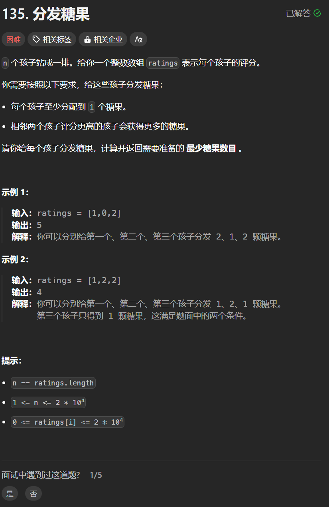

# 135. 分发糖果
## 题目链接  
[135. 分发糖果](https://leetcode.cn/problems/candy/)
## 题目详情


***
## 解答一
答题者：**Yuiko630**

### 题解
> 先从前往后比较右孩子比左孩子得分高的情况，右孩子就比左孩子多一个糖果；再从后往前比较左孩子比右孩子得分高的情况，左孩子就取当前与右孩子糖果+1的最大值，最后求累加和即可。

### 代码
``` Java
class Solution {
    public int candy(int[] ratings) {
        int size = ratings.length;
        int[] candies = new int[size];
        candies[0] = 1;
        // 从前往后比较右孩子比左孩子大
        for(int i = 1; i < size; i++){
            if(ratings[i] > ratings[i - 1]){
                candies[i] = candies[i - 1] + 1;
            }
            else candies[i] = 1;
        }
        // 从后往前比较左孩子比右孩子大
        for(int i = size - 2; i >= 0; i--){
            if(ratings[i] > ratings[i + 1]){
                candies[i] = Math.max(candies[i+1] + 1, candies[i]);
            }
        }
        int sum = 0;
        for(int i = 0; i < size; i++){
            sum += candies[i];
        }
        return sum;
    }
}
```