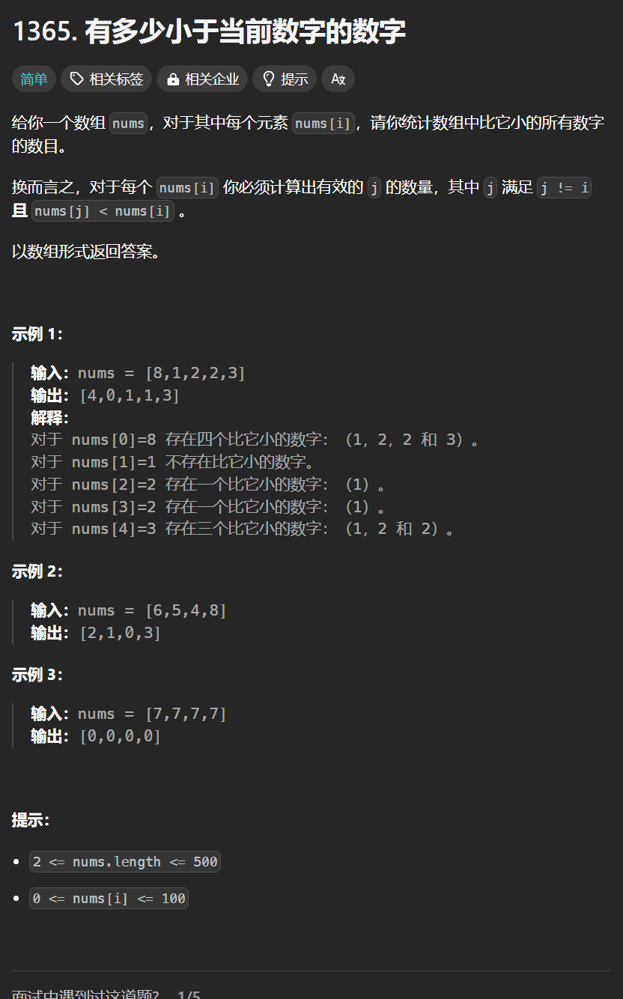

# 1365. 有多少小于当前数字的数字
## 题目链接  
[1365. 有多少小于当前数字的数字](https://leetcode.cn/problems/how-many-numbers-are-smaller-than-the-current-number)
## 题目详情


***
## 解答一
答题者：**Yuiko630**

### 题解
>先从小到大排序，排序后的下标即题求，可以用map映射。

### 代码
``` Java
class Solution {
    public int[] smallerNumbersThanCurrent(int[] nums) {
        int[] numsCopy = Arrays.copyOf(nums, nums.length);
        Map<Integer, Integer> map = new HashMap<>();
        Arrays.sort(numsCopy);
        for(int i = nums.length - 1; i >= 0; i--){
            map.put(numsCopy[i], i);
        }
        for(int i = 0; i < nums.length; i++){
            numsCopy[i] = map.get(nums[i]);
        }
        return numsCopy;
    }
}
```
