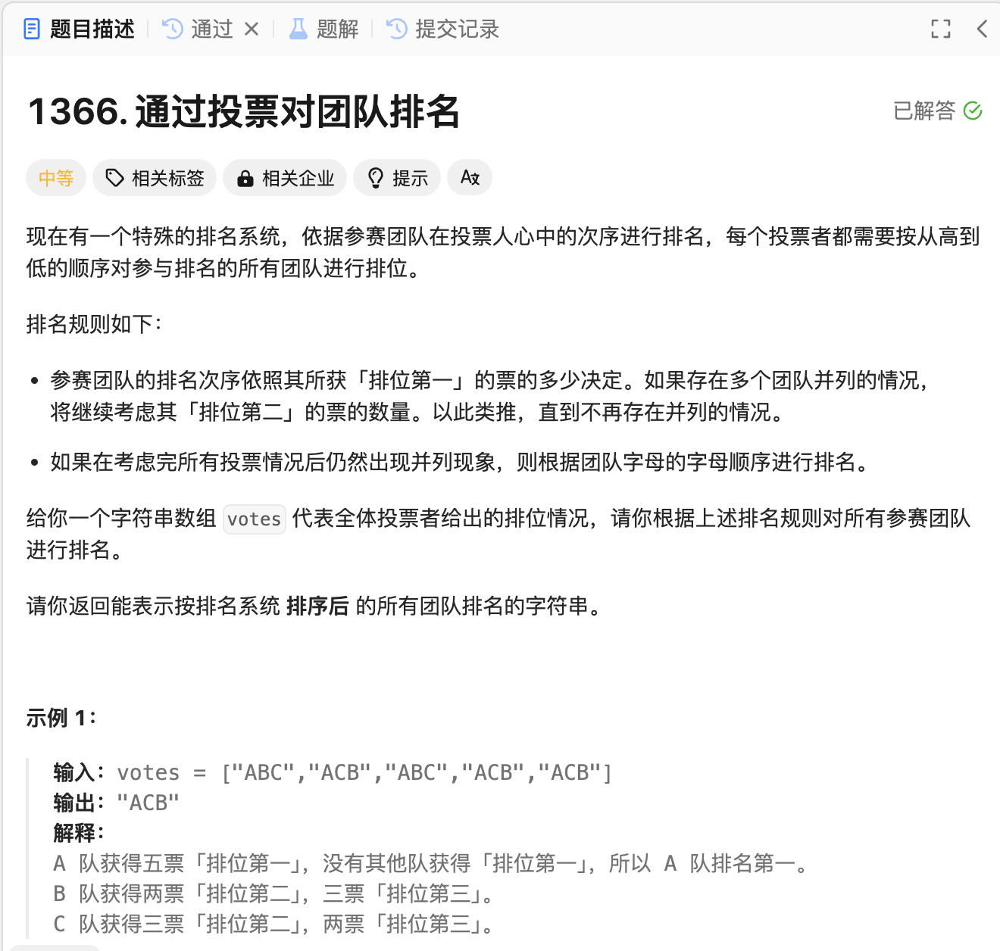

# 1366. 通过投票对团队排名
## 题目链接  
[1366. 通过投票对团队排名](https://leetcode.cn/problems/rank-teams-by-votes/description/?envType=daily-question&envId=2024-12-29)
## 题目详情


***
## 解答一
答题者：EchoBai

### 题解
用一个map统计每个字符在每个位次上出现的次数，然后自定义排序规则，先按照第一个顺序的数量，然后第二个，依次类推，最后按照字典顺序。排序完毕后拼接字符串然后返回结果即可。

### 代码
``` cpp
class Solution {
public:
    string rankTeams(vector<string>& votes) {
        int size = votes.size();
        if(size == 1) return votes[0];

        int teamsNum = votes[0].size();
        //[teams, [0, 0, 0...]]
        std::map<char,vector<int>> mp;
        for(const char c : votes[0]){
            mp[c] = vector<int>(teamsNum, 0);
        }
        
        // get every location votes
        for(const string& s : votes){
            for(int i = 0; i < teamsNum; ++i){
                mp[s[i]][i]++;
            }
        }

        // ensure sort rule
        vector<char> teams(votes[0].begin(), votes[0].end());
        sort(teams.begin(), teams.end(), [&](const char a,  const char b){
            for(int i = 0; i < teamsNum; ++i){
                if(mp[a][i] != mp[b][i]){
                    return mp[a][i] > mp[b][i];
                }
            }
            return a < b;
        });

        string res;
        for(const char c : teams){
            res += c;
        }
        
        return res;
    } 
};
```
