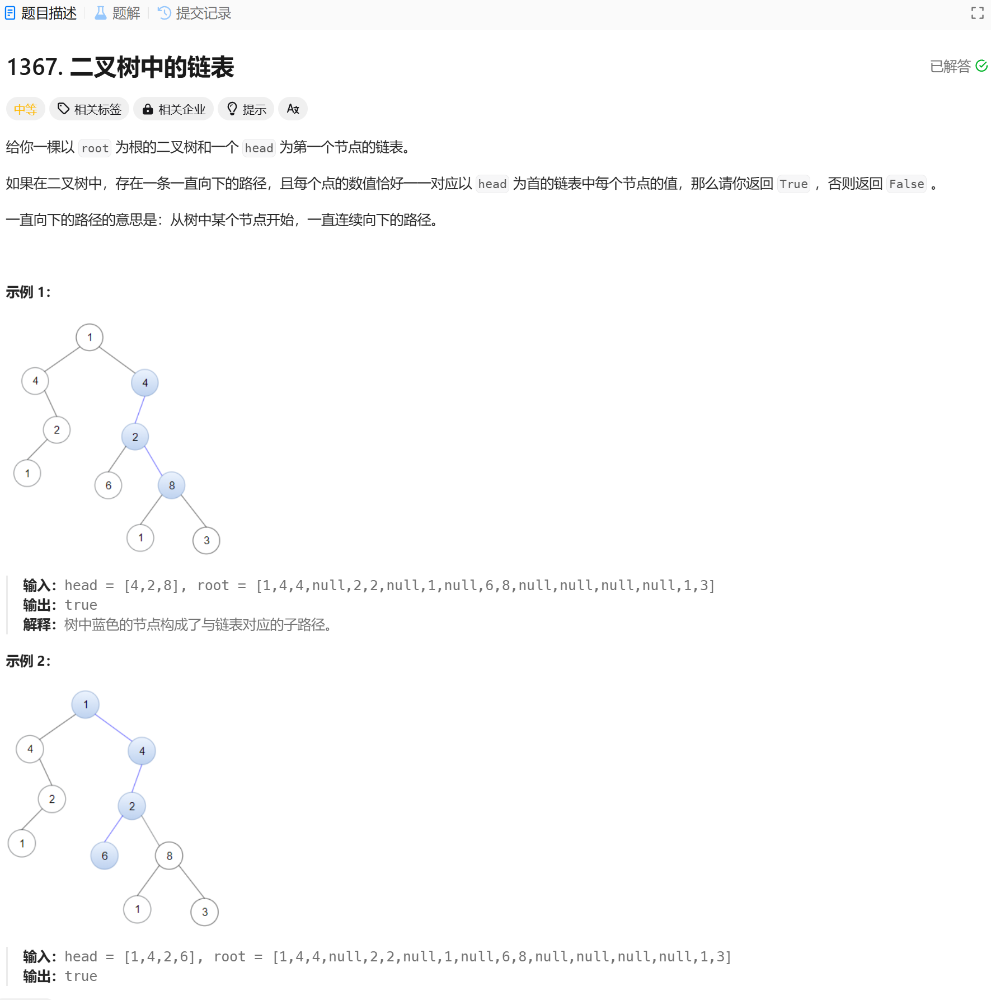

# 1367. 二叉树中的链表
## 题目链接  
[1367. 二叉树中的链表](https://leetcode.cn/problems/linked-list-in-binary-tree/description/?envType=daily-question&envId=2024-12-30)
## 题目详情


***
## 解答一
答题者：EchoBai

### 题解
使用递归，如果二者相等，那就在左右子树上比较，如果能一直移动指针到链表末尾那说明可以找到，一旦二叉树节点为空或者二者值不相等立即返回调用处。最后在主函数检查从根开始以及左右子树是否存在即可。

### 代码
``` cpp
/**
 * Definition for singly-linked list.
 * struct ListNode {
 *     int val;
 *     ListNode *next;
 *     ListNode() : val(0), next(nullptr) {}
 *     ListNode(int x) : val(x), next(nullptr) {}
 *     ListNode(int x, ListNode *next) : val(x), next(next) {}
 * };
 */
/**
 * Definition for a binary tree node.
 * struct TreeNode {
 *     int val;
 *     TreeNode *left;
 *     TreeNode *right;
 *     TreeNode() : val(0), left(nullptr), right(nullptr) {}
 *     TreeNode(int x) : val(x), left(nullptr), right(nullptr) {}
 *     TreeNode(int x, TreeNode *left, TreeNode *right) : val(x), left(left), right(right) {}
 * };
 */
class Solution {
    vector<int> path;
public:
    bool isSubPath(ListNode* head, TreeNode* root) {
        if(!head || !root) return false;
        return trace(head, root) || isSubPath(head, root->left) || isSubPath(head, root->right);
       

    }
    bool trace(ListNode* head, TreeNode* root) {
        if (!head) return true; 
        if (!root) return false; 
        if(root->val != head->val) return false;
        return trace(head->next, root->left) || trace(head->next, root->right);
    }

};
```
