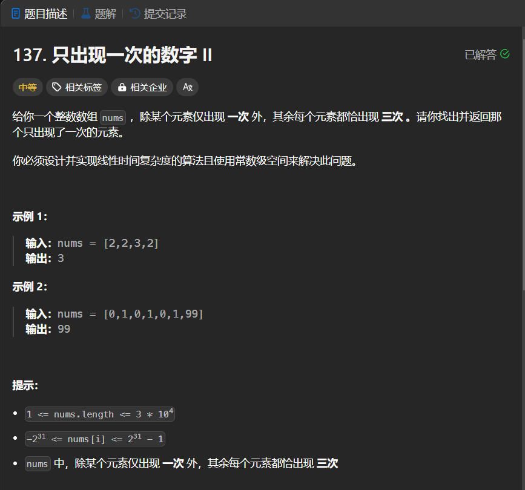

# 137. 只出现一次的数字 II
## 题目链接  
[137. 只出现一次的数字 II](https://leetcode.cn/problems/single-number-ii/?envType=study-plan-v2&envId=top-interview-150)
## 题目详情


***
## 解答一
答题者：EchoBai

### 题解
用哈希表映射出每个数字出现的次数，查询出次数为1的即可，但是这样的问题在于空间复杂度为`O(n)`。

### 代码
``` cpp
class Solution {
public:
    int singleNumber(vector<int>& nums) {
        int res = nums[0];
        if(nums.size() == 1)
            return res;
        map<int,int>m;
        for(int i = 0; i < nums.size(); ++i){
            ++m[nums[i]];
        }
        map<int, int>::iterator it;
        for(it = m.begin(); it != m.end(); ++it){
            if(it->second == 1){
                res = it->first;
                break;
            }
        }
        return res;
    }
};
```
