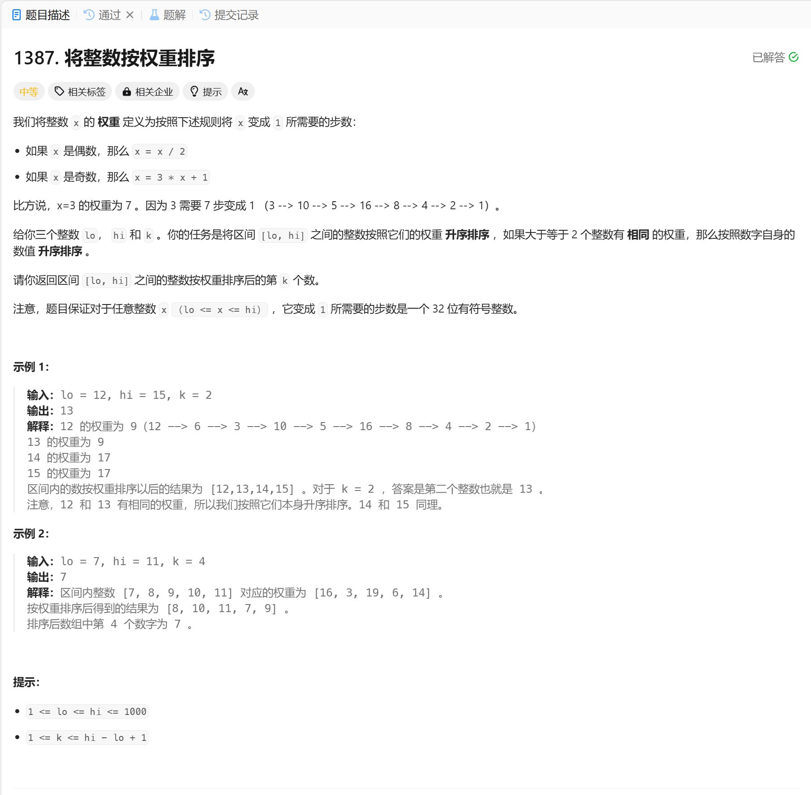

# 1387. 将整数按权重排序
## 题目链接  
[1387. 将整数按权重排序](https://leetcode.cn/problems/sort-integers-by-the-power-value/description/?envType=daily-question&envId=2024-12-22)
## 题目详情


***
## 解答一
答题者：EchoBai

### 题解
自定义排序即可。

### 代码
``` cpp
class Solution {
public:
    int getKth(int lo, int hi, int k) {
        vector<std::pair<int,int>> vt;
        for(int i = lo; i <= hi; ++i){
            vt.emplace_back(i, getWeight(i));
        }
        sort(vt.begin(), vt.end(), [&](const std::pair<int,int>& a, const std::pair<int,int>& b){
            if(a.second == b.second){
                return a.first < b.first;
            }
            return a.second < b.second;
        });
        return vt[k-1].first;
    }

    int getWeight(int val){
        int cnt = 0;
        while(val != 1){
            if(val % 2 == 0){
                val /= 2;
            }else{
                val = val * 3 + 1;
            }
            ++cnt;
        }
        return cnt;
    }
};
```
