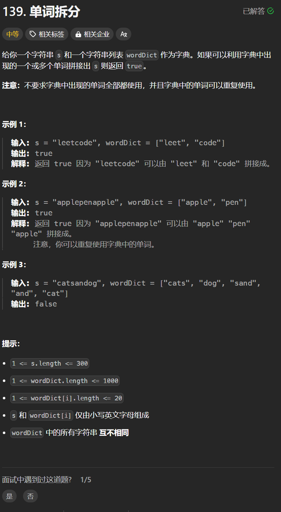

# 139. 单词拆分
## 题目链接  
[139. 单词拆分](https://leetcode.cn/problems/word-break/)
## 题目详情


***
## 解答一
答题者：**Yuiko630**

### 题解
> 题目可理解为用单词填字符串能不能填满，dp，五部曲
>1. 定义:dp[j]表示字符串长度为i时，能否拆分
>2. 转移方程:dp[i] = dp[j] && str[j-i]是否在words表中出现
>3. 初始化:dp[0]=true，否则后面一直是false了
>4. 遍历:填充时顺序很重要，所以是排列问题，外层是背包容量，内层是单词
>5. 推导

### 代码
``` Java
class Solution {
    public boolean wordBreak(String s, List<String> wordDict) {
        boolean[] dp = new boolean[s.length()+1];
        dp[0] = true;
        for(int i = 1; i <= s.length(); i++){
            for(int j = 0; j < i && !dp[i]; j++){
                String key = s.substring(j, i);
                boolean flag = false;
                for(String str: wordDict){
                    if(str.equals(key)) flag = true;
                }
                dp[i] = dp[j] && flag;
            }
        }
        return dp[s.length()];
    }
}
```