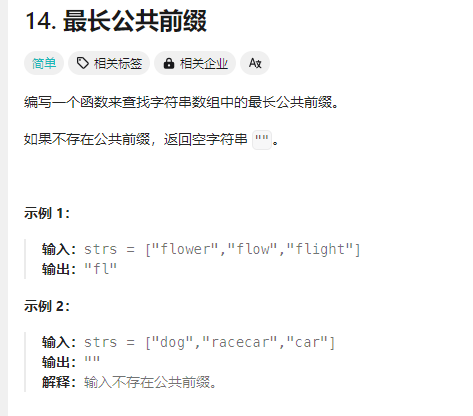

# 14. 最长公共前缀
## 题目链接  
[链接](https://leetcode.cn/problems/longest-common-prefix/?envType=study-plan-v2&envId=top-interview-150)
## 题目详情


***
## 解答一
答题者：** Curtis **
### 代码
``` cpp
class Solution {
public:
    string longestCommonPrefix(vector<string>& strs) {
        if(strs.size()==0){
            return "";
        }
        if(strs.size()==1){
            return strs[0];
        }
        string curLongest = strs[0];
        for(int i = 1;i<strs.size();++i){
            
            string curCheck = strs[i];
            for(int j = 0;j<curLongest.size();++j){
                if(curLongest[j]!=curCheck[j]){
                    curLongest = curLongest.substr(0,j);
                    std::cout<< "curLongest:"<<curLongest<<endl;
                    break;
                }
            }
            if(curLongest.size()==0){
                break;
            }
        }
        return curLongest;

    }
};
```

### 题解

>按照第一感觉直接遍历，一看就知道我在干什么