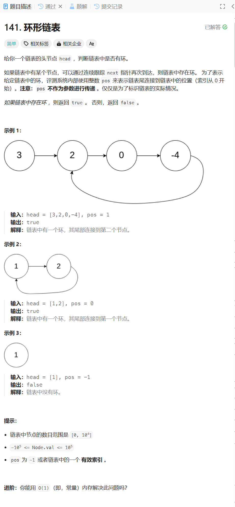

# 141. 环形链表
## 题目链接  
[141. 环形链表](https://leetcode.cn/problems/linked-list-cycle/)
## 题目详情


***
## 解答一
答题者：**Yuiko630**

### 题解
> 用快慢指针作为兔子和乌龟，兔子一次跳2个，乌龟一次爬1个，如果在某节点相遇则说明有环，否则无环。

### 代码
``` Java
/**
 * Definition for singly-linked list.
 * class ListNode {
 *     int val;
 *     ListNode next;
 *     ListNode(int x) {
 *         val = x;
 *         next = null;
 *     }
 * }
 */
public class Solution {
    public boolean hasCycle(ListNode head) {
        if(head == null || head.next == null) return false;
        ListNode slow = head;
        ListNode quick = head.next;
        while(quick != null && quick.next != null){
            if(quick == slow) return true;
            quick = quick.next.next;
            slow = slow.next;
        }
        return false;
    }
}
```