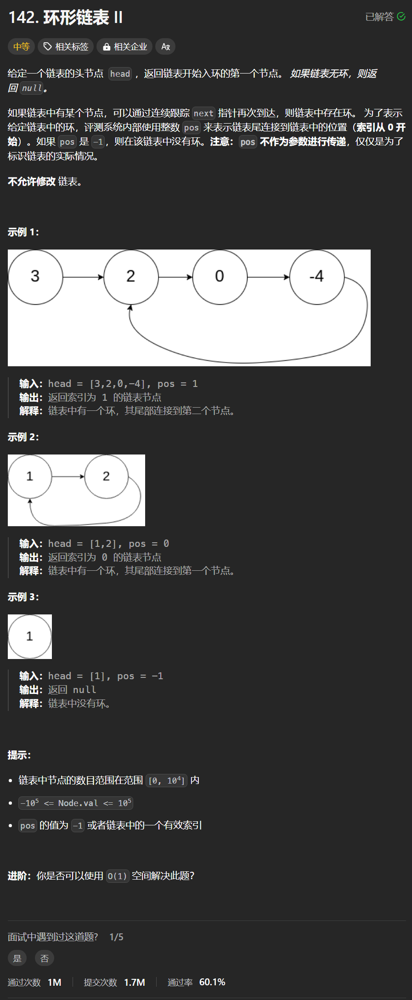

# 142. 环形链表II
## 题目链接  
[142. 环形链表II](https://leetcode.cn/problems/linked-list-cycle-ii/)
## 题目详情


***
## 解答一
答题者：**Yuiko630**

### 题解
> 用快慢指针作为兔子和乌龟，兔子一次跳2个，乌龟一次爬1个，如果在某节点相遇则说明有环，否则无环。头节点和相遇节点重合位置即为环的入口。

### 代码
``` Java
/**
 * Definition for singly-linked list.
 * class ListNode {
 *     int val;
 *     ListNode next;
 *     ListNode(int x) {
 *         val = x;
 *         next = null;
 *     }
 * }
 */
public class Solution {
    public ListNode detectCycle(ListNode head) {
        if(head == null || head.next == null) return null;
        ListNode fast = head;
        ListNode slow = head;
        int flag = 0;
        while(fast != null && fast.next != null){   
            fast = fast.next.next;
            slow = slow.next;
            if(fast == slow){
                flag = 1;
                break;
            }
        }
        if(flag == 0) return null;
        ListNode node2 = slow;
        ListNode node1 = head;
        while(node1 != node2){
            node1 = node1.next;
            node2 = node2.next;
        }
        return node1;
    }
}
```